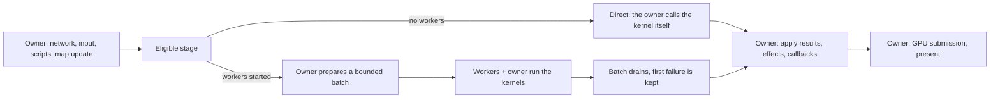

# Optional Client Multithreading

## What this is

Client multithreading is a **runtime option, not a build option**. One binary runs both modes, and the boolean
`Client.Multithreading` decides at startup which one: off runs everything on the application thread, on lets the
engine start CPU worker threads beside it. **How many is the engine's decision, not a setting** — it is read
from the machine by the rule in [How many workers](#how-many-workers), because a count written into a config is
right for the machine it was written on and wrong everywhere else. There is no `FO_ENABLE_CLIENT_MULTITHREADING`
macro and no separate artifact — a build that could only run one of the modes would make the two impossible to
compare on the same machine, which is the whole point of the option.

What is implemented today:

- [WorkScheduler](../Source/Client/WorkScheduler.h) — bounded CPU batches over persistent workers,
  owned per `ClientEngine`.
- A two-phase per-frame sprite update in [SpriteManager](../Source/Client/SpriteManager.cpp), where a sprite
  declares CPU-only work the batch may spread.
- Model animation pose evaluation split into prepare / evaluate / finalize in
  [ModelInstance](../Source/Client/ModelInstance.cpp), with the evaluation as the first — and so far only — stage
  a worker runs.

What is **not** implemented, and is not promised by the option: a render thread, GPU command recording off the
application thread, concurrent script execution, parallel lighting/fog/particles, an asynchronous resource lane,
and threaded Web builds. The sections below say why, and the plan at the end says in what order they are worth
revisiting.

**No speedup is claimed here.** The frame-time evidence the plan calls for has not been collected yet. What has
been established is that both modes produce the same pose, that the serial mode does not enter any of the
machinery added for the parallel one, and that an embedding project's whole player-visible surface walks the
same in both modes on real content. See [Measuring it](#measuring-it).

## The execution contract

The application thread is the sole owner of client entities, scripts, input, the renderer, the sprite/atlas
managers, and resource publication. A worker only ever runs a **kernel**: a pure CPU computation over state the
batch item exclusively owns, plus immutable data whose lifetime the owner has pinned for the batch.



Two rules make this checkable rather than hopeful:

- **A worker never holds a borrow it did not get through its own item index.** Capturing a client, an entity, a
  manager or the renderer and calling methods through it is out, whatever `const` says about the signature.
- **The owner never publishes anything while a batch is running.** `RunBatch` is synchronous: it returns only
  after every item has completed, so there is no window in which a worker and the owner both touch the frame.

That second rule is what keeps shutdown trivial. There is no "stop admission, cancel, drain" sequence, because
outside a `RunBatch` call there is never outstanding work; the scheduler destructor only has idle workers to join.
The price is that a batch cannot outlive its stage, which rules out cross-frame work — a future resource lane
needs its own bounded queue and generation handling, and is not this object.

## The scheduler

`WorkScheduler` lives on `ClientEngine` as `WorkSched` and is handed to `SpriteManager` at
construction. Each embedded client has its own, so two clients in one process never share workers, a cancellation
or a failure.

```cpp
if (scheduler->ShouldRunParallel(item_count, min_items)) {
    scheduler->RunBatch("StageName", item_count, 1, [&](size_t index) { RunKernel(items[index]); });
}
else {
    for (auto& item : items) {
        RunKernel(item);
    }
}
```

This is the shape every eligible stage takes, and it is the only place a stage decides. `ShouldRunParallel` is
false when the client is serial, when the caller's own threshold is not met, and when there is a single item —
so the `else` branch is an ordinary loop with no job, no future, no completion counter and no scratch buffer.

Scheduling details worth knowing before adding a second stage:

- **Chunks are coarse.** At most one per participating thread, never smaller than the caller's
  `min_items_per_chunk`. Scheduling cost scales with threads, not with items.
- **The owner participates.** With busy or slow-to-wake workers it can run the whole batch itself, so a chunk is
  never left unclaimed and a saturated machine degrades to serial rather than stalling.
- **A batch is closed before the next opens.** Workers copy the batch descriptor under the mutex and are counted
  while they hold it; `RunBatch` waits for that count to reach zero. Without it, a worker that woke after its
  batch finished would claim a chunk index against the *next* batch and run the previous batch's kernel.
- **Failure is reported once, on the owner.** The first `std::exception` an item throws is captured, the
  remaining chunks stop early, and the exception is rethrown from `RunBatch` at the owner's own consumption
  point. A failed item is never silently rerun on the main thread. `catch (...)` in a worker is a defect handler:
  it raises `FO_UNKNOWN_EXCEPTION()` and the process exits, per [ExceptionSafety.md](ExceptionSafety.md) §2.1.
- **Nesting is refused.** A batch submitted from inside a batch throws instead of deadlocking against a pool it
  is itself occupying.

## How many workers

`Client.Multithreading` is a switch, and the worker count behind it is chosen once, at client construction, by
`WorkScheduler::ChooseWorkerCount`. It reads three facts through `ReadWorkerCountInputs` — the logical core count,
whether the build can start threads at all, and whether the CPU is a phone's — and applies these rules in order,
with the three thresholds taken from settings (defaults in brackets):

| Rule | Why |
|---|---|
| No thread support (Web) → no workers | The browser build is compiled without `-pthread`. The switch can be on in a config Web shares, and the client then runs serial rather than failing to start. |
| Unknown core count → no workers | A machine that reports nothing gives the rule nothing to divide; serial is the one answer that cannot oversubscribe it. |
| One core is kept for the application thread | It is not idle during a batch: it runs a share of the chunks itself, so counting it as a worker would put two busy threads on one core. |
| From `Client.MultithreadingHeadroomMinCores` (4) cores, one more is kept | Every client keeps threads of its own — the graphics driver's submission thread, the audio mixer, the managed runtime. Below four cores that core is worth more to the batch than as headroom. |
| A phone is capped at `Client.MultithreadingMaxMobileWorkers` (2) | A phone mixes fast and slow cores and runs on a thermal budget. Chunks are claimed dynamically but are equal in size, so one landing on a slow core holds the whole batch back; the fast cluster a phone can count on is small. The cap applies on top of the general one and never lifts it. |
| Every machine is capped at `Client.MultithreadingMaxWorkers` (8) | The only batch today is a frame's model poses. Past this many helpers it splits into chunks of a pose or two, and every extra worker adds a wake and a join for no work. |

With the defaults that gives 0 workers on 1 core, 1 on 2, 2 on 3 and 4, 4 on 6, 6 on 8, and 8 from 10 cores up;
a phone gets at most 2. Zero is a legitimate answer: the client then runs serial with the switch on, which is why the startup log
names the count actually started and what limited it —
`Client multithreading: on, 6 worker threads (8 logical cores, one core kept for the application thread and one
for driver, audio and runtime)`, `Client multithreading: on, running serial (1 logical cores, no core is left
over beside the application thread)`, or `Client multithreading: off`.

The three thresholds are initial values, set by reasoning rather than measured; the profiling stage is what
revises them, and because they are settings a capture can sweep them with no rebuild. They tune the rule, not the
answer: there is still no setting that names a worker count, because a count is right only for the machine it was
written on, while a cap or a headroom threshold means the same thing on every machine. A cap may be `0` — the
mobile cap at `0` keeps phones serial while desktops run parallel — and none may exceed `MAX_WORKER_THREADS` (64),
the scheduler's own construction limit; `ChooseWorkerCount` rejects a cap outside `0..64` or a negative threshold
on every platform, including the ones where it would not change the answer. Chunk sizes are not part of the rule:
a stage still sets its own minimum per chunk, and `ShouldRunParallel` still keeps a batch too small to spread on
the owner.

## The first stage: sprite CPU updates

`SpriteManager::BeginScene` used to walk `_updateSprites` and call `Update()` on each sprite. It now materializes
the live set into a vector first — which also removes a latent hazard, since an `Update()` that starts updating
another sprite used to insert into the map being iterated — and then, **only when the client is parallel**, runs
a preparation pass over it:

1. `Sprite::PrepareUpdate()` on the owner. It decides what this sprite will do this frame and settles everything
   a worker must not touch. Returning `true` means `RunPreparedUpdate()` now holds CPU-only work.
2. `Sprite::RunPreparedUpdate()` — the batch item. It may touch nothing but that sprite's own state.
3. `Sprite::Update()` on the owner, where the GPU and the shared managers exist again.

A serial client never enters this path at all. `Update()` then runs exactly the single-pass body it always did,
predicate included, so callbacks and effects keep their original position relative to the other sprites of the
frame. This is deliberate, and the reason is worth stating plainly: hoisting preparation ahead of the other
sprites is a **real ordering change**. Preparing a model can advance a timeline, which can re-resolve its
movement animation, which fires the client's animation-init event into scripts — and a script is free to touch
another critter. In the single-pass order that script ran before the next model was posed; with a batch, a model
prepared earlier in the same pass keeps the inputs it captured and shows the change one frame later. Nothing
dangles (a pose's joint masks are sized once, at construction, and the live set holds every sprite by
`shared_ptr` for the whole update), and the sprite set was already walked in unordered-map order, so no
deterministic order was lost. But it is a behavioural difference, it is confined to the mode that buys something
for it, and a visual comparison of the two modes is part of promoting that mode.

### Model animation poses

`ModelSprite` is the only sprite kind that implements the two phases so far. A model frame pose is now three
phases, and `PoseSpriteFrame` is the three called in a row:

| Phase | Thread | What it does |
|---|---|---|
| `PrepareSpriteFramePose` | owner | Root transformation, body rotation, timeline advance (which can re-resolve a movement animation and reach the client's animation-init callback), track inputs and joint masks read out of the controllers, procedural rotations, ground position pushed down the hierarchy. Recursive. |
| `EvaluateFramePose` | worker | `ModelAnimationRuntimePose::Evaluate` per node, the world-matrix snapshot, the linked-joint overrides, and each child's parent matrix. Recursive. Reads only this hierarchy's own buffers plus the immutable rig. |
| `FinalizeFramePose` | owner | Children first, then attached particle setup and update, the configuration layout refresh, and the animation callbacks. Recursive. |

A child reads the joint its parent has just posed, so the **whole hierarchy is one batch item** rather than one
item per node. Splitting it further would need a barrier per depth level for no gain: hierarchies are shallow.

Ozz sampling is safe here because every buffer it writes belongs to the pose object — the sampling contexts, the
per-track locals, the joint weights and the model matrices are all per-instance — while the skeleton and the
clips are shared and immutable. The ozz allocator is installed before any pose is constructed and forwards to
`safe_alloc`, which is thread-safe.

The frame-sizing loop in `ModelSpriteFactory::DrawModelToAtlas` consumes the prepared pose as its first pass and
finishes it there; the re-poses that converge the frame size stay serial, since they are rare after warmup and
run inside the GPU-owning stage anyway. A sprite carrying a prepared pose keeps the frame that pose was built
against — settling the frame again would move the root under an already evaluated skeleton.

Direct-draw models (`Render.ModelDirectDraw`), GUI previews and `Prewarm` keep the single-pass path: their poses
happen on demand, inside drawing, where no batch boundary exists.

## What stays on the owner, and why

| Area | Why it is not a batch item |
|---|---|
| `MapView::Process`, `CritterHexView::Process` | Iteration mutates entities, map fields and deletion lists. |
| `MapView::DrawMap` | Rebuilds map data, fires script events between render stages, and records GPU work. |
| Lighting and fog | `ApplyLightFan` mutates shared map state; `FogShape::Input` traces live map state through a callback. Both need a pure kernel and an immutable obstacle view first, and the serial mode must not pay to build that view. |
| Particles | SPARK and Effekseer share managers, random state and resource callbacks across systems. Middleware threading and client workers also have to be counted against one CPU budget, not enabled independently. |
| Network | Stream decompression is stateful and ordered, and packet handlers mutate client entities. A transport offload needs an ordered byte handoff, not a parallel loop. |
| Resource preparation | `ReadSpriteResource` is a usable CPU contract, but publication touches the cache, the atlas and the GPU. This is a cross-frame lane with generations, not a frame batch. |
| Scripts, renderer, GPU objects | Single-owner by design. Concurrent C# callbacks and a render thread are outside this feature. |

SDL documents event polling and GL context selection as main-thread operations, so the portable renderer stays
there regardless of what the CPU workers do.
([SDL_PollEvent](https://wiki.libsdl.org/SDL3/SDL_PollEvent),
[SDL_GL_MakeCurrent](https://wiki.libsdl.org/SDL3/SDL_GL_MakeCurrent).)

## Platforms

| Target | State |
|---|---|
| Windows, Linux | Both modes available. Validate here first. |
| macOS, Android, iOS | Both modes compile and the scheduler is generic, but neither has been validated; do not advertise parallel mode there until it has. Android and iOS get the mobile cap. |
| Web | Serial only. The worker-count rule answers zero there, so `Client.Multithreading` may be on in a shared config and the client still starts serial, saying so in its log. The Emscripten configuration does not enable `-pthread`, and the browser Mono runtime has its own initialization and main-thread attachment rules ([WebDebugging.md](WebDebugging.md), [Emscripten pthreads](https://emscripten.org/docs/porting/pthreads.html)). A threaded Web build is a separate artifact with COOP/COEP isolation and loader selection, and blocking the browser main thread on a worker would stall it — that lane needs non-blocking orchestration of its own. |
| Mapper | Serial always, whatever the setting says. It edits content on one thread and gains nothing. |

## Measuring it

Four lanes, identical resources, settings, renderer, optimization and workload:

| Lane | Purpose |
|---|---|
| A: the revision before this feature | Detect cost introduced by splitting the shared kernels. |
| B: this revision, `Multithreading = False` | The serial path, against A. |
| C: this revision, `Multithreading = True` on a small scene | Scheduler overhead where there is nothing to spread. |
| D: this revision, `Multithreading = True` on a crowded scene | Useful scaling, and whether the chosen count is the one that pays — lane D rerun with `Client.MultithreadingMaxWorkers` lowered shows where more workers stop paying, and that answer revises the defaults. |

Measure median/p95/p99 frame time, CPU critical-path time, GPU time, batch preparation and join wait, allocations
after warmup, RSS, and input-to-present latency. Run both uncapped and frame-capped sessions, and include a
low-core machine so scheduler overhead cannot hide inside a crowd scene. Average FPS proves nothing.

The capture already carries the zones this needs. `SpriteManager::UpdateSprites` and `PrepareSpriteCpuUpdates`
(`Render`) frame the stage on the application thread; `WorkScheduler::RunBatch` (`Threading`) spans the batch,
join wait included; each participant's share is a `WorkScheduler::RunClaimedChunks` zone on its own thread, with
the kernel, `ModelInstance::EvaluateAnimationPose` (`Model`), inside it. The owner's share sits inside `RunBatch`,
so the join wait is that zone's time outside its `RunClaimedChunks`.

Proposed gates, to pin before promoting the mode: A→B no worse than 1% on median CPU frame time and 2% on
p95/p99, with enough repeated runs to resolve that; for D, a repeatable end-to-end gain on a declared target
workload with no extra buffered frame and no material regression on small scenes. The benefit is bounded by the
serial remainder — `T ≈ T_serial + T_parallel / P + T_prepare + T_join` — so a large speedup of one kernel does
not imply a comparable frame-time gain, especially when the GPU or the scripts dominate.

Structural gates are stricter than the timing ones, and they hold today: nothing added on the direct path, no
worker access to owner-only state, bounded pending work, and no task left at teardown.

## Tests

- [Test_WorkScheduler.cpp](../Source/Tests/Test_WorkScheduler.cpp) — the worker-count rule against limits of
  the test's own (every row of the table above, a zero cap, the mobile cap never lifting the general one, a limit
  out of range refused, and a sweep over 0..256 cores proving more cores never mean fewer workers and the owner
  always keeps a core), the machine inputs matching the platform, the serial path, every item running exactly once, repeated batches never crossing over, empty and single-item
  batches, the chunk minimum, the parallel threshold, item exceptions reaching the owner with the scheduler still
  usable, nested submission refused, shutdown with workers, two schedulers side by side, serial/parallel producing
  the same result, `ClientMultithreadingFollowsTheSetting` — a real client engine starting no workers when the
  switch is off and exactly the count the rule gives this host when it is on, a lowered `Client.MultithreadingMaxWorkers` reaching
  that count, and running frames in both modes —
  and `ClientSpriteUpdatePhasesFollowTheClientMode`, which
  drives a real frame over recording sprites: a serial client calls only `Update()`, and a parallel one prepares
  every sprite before any evaluation and finishes none until the whole batch has drained. That last one was
  checked against its own falsification (dropping the serial guard fails it).
- [Test_ModelAnimationPoseProcedural.cpp](../Source/Tests/Test_ModelAnimationPoseProcedural.cpp) —
  `ModelAnimationRuntimePosesEvaluateIdenticallyOnClientWorkers`: separate poses over one shared rig, evaluated
  across real worker threads and repeated, give world matrices bit-identical to the serial evaluation. This is the
  claim the whole feature rests on, so it is covered where it can run in every configuration.
- [Test_ClientEngine.cpp](../Source/Tests/Test_ClientEngine.cpp) — `ModelPosePhasesMatchTheSinglePassPose`: the
  split `ModelInstance` phases, interleaved as a batch interleaves them and then run through a real scheduler,
  land on the same pose as the single-pass one. That file is compiled only in an AngelScript-enabled build, since
  the baked-model fixtures live there; the kernel-level cover above is the unconditional one.

Run the native tests under ThreadSanitizer where it is available, and apply
[ThreadSafetyAnalysis.md](ThreadSafetyAnalysis.md) to the scheduler's shared state. Neither proves task lifetime,
exclusive ownership or callback order on its own. Headless tests cannot establish visual parity: a real renderer
still has to be inspected for animation, attachments, shadows, particle timing, bounds and hit testing, map
transitions and GUI previews. An embedding project with a live client harness should also walk one
player-visible surface twice, once per mode, and compare the two verdicts.

## Where this goes next

1. **Profile.** The frame-time lanes above, on the two validated platforms. Everything below is worth doing only
   in the order the profile puts them.
2. **A second stage, chosen by that profile.** Lighting geometry is the most likely, and it needs a pure kernel
   plus an immutable obstacle view before it can be one.
3. **A resource lane.** Bounded prepare/publish with request generations, judged on loading latency and stalls,
   not on steady FPS. It is a different object from this scheduler.
4. **Platform validation** for macOS and Android, and a decision on whether a threaded Web artifact is worth its
   separate loader and isolation requirements.
