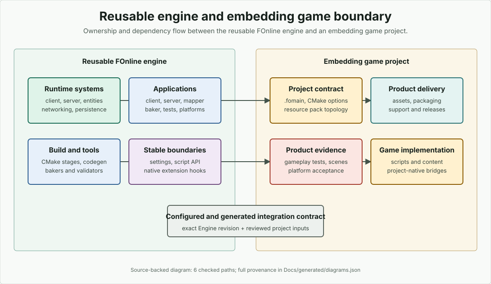

# Engine Architecture

This document gives a source-grounded map of the FOnline engine layers. Use it when deciding where a behavior belongs before opening subsystem-specific docs.

## Ownership decision

Route a change through these four decisions:

1. Put behavior that must work the same for multiple games in the Engine source
   layer and the corresponding Engine subsystem guide. Put game rules, authored
   content, product configuration, acceptance thresholds, and release policy in
   the embedding project.
2. Use this architecture page when behavior crosses several Engine layers or
   the Engine/project boundary. Use [Source Tree](../../contributing/source-tree/)
   when the question is where code lives or which directory to inspect first.
3. Keep generated Engine contracts tied to their owning Engine source,
   machine model, and generator. Project inputs and generated project outputs do
   not become reusable Engine authority merely because an Engine tool consumes
   or emits them.
4. Link from the non-owning page to the owner instead of restating the contract.
   A source-directory inventory is not an architecture decision, and a project
   integration is not proof of generic Engine behavior.

A complete boundary answer names both the owner and the documentation route:
use this page for architecture-wide behavior, Source Tree for source navigation,
and the owning subsystem guide for its detailed contract.

## Big picture

FOnline is organized around a reusable engine embedded by a game project. The game project owns content, scripts, product configuration, and release policy; the engine owns reusable runtime systems, tools, generated API infrastructure, platform frontends, and build composition.

<figure class="docs-diagram">
<picture>
<source media="(max-width: 700px)" srcset="../../../assets/diagrams/engine-game-boundary-mobile.svg">

</picture>
<figcaption>Engine owns reusable runtime and tooling; the embedding project owns game rules, content, product configuration, validation, and release policy. Dependencies cross only through declared configuration, generated contracts, and extension hooks.</figcaption>
</figure>

The main layers are:

- **Applications** — executable and library entry points in `Source/Applications/`.
- **Essentials** — low-level platform, memory, filesystem, logging, serialization, sockets, and utilities in `Source/Essentials/`.
- **Common runtime** — shared engine model in `Source/Common/`: entities, properties, prototypes, maps, networking primitives, config, scripts, and engine base services.
- **Client runtime** — presentation/resource/network-client side in `Source/Client/`.
- **Server runtime** — authoritative world, managers, database backends, network-server side, and updater backend in `Source/Server/`.
- **Frontend** — application/window/rendering abstraction in `Source/Frontend/`.
- **Scripting** — AngelScript, Native, Mono, and script method registration in `Source/Scripting/`.
- **Tools** — baker, Mapper-centered editing, asset processors, and related developer tooling in `Source/Tools/`.
- **BuildTools** — CMake stages, helpers, toolchains, platform project generation, package layout, and validation support in `BuildTools/`.

## Application layer

`Source/Applications/` is the practical entry-point directory. It contains app wrappers such as:

- `ClientApp.cpp` and `ClientLib.cpp` for client host/runtime flows.
- `ServerApp.cpp`, `ServerDaemonApp.cpp`, `ServerHeadlessApp.cpp`, and `ServerServiceApp.cpp` for server variants.
- `MapperApp.cpp` for the central interactive editing tool.
- `BakerApp.cpp` and `ASCompilerApp.cpp` for generation/build support.
- `TestingApp.cpp` for test execution.

`BuildTools/cmake/stages/Applications.cmake` wires these files into project-specific targets based on build options such as client/server/tool/platform/library modes. Avoid hard-coding target names in engine docs: target names are often derived from the embedding project's `FO_DEV_NAME` and presets.

See [Applications](../../reference/applications.md) for the application map.

## Source paths inspected

- `Source/Applications/`
- `Source/Common/EngineBase.h`
- `Source/Common/EngineBase.cpp`
- `Source/Common/Entity.h`
- `Source/Common/Entity.cpp`
- `Source/Common/ScriptSystem.h`
- `Source/Common/ScriptSystem.cpp`
- `Source/Client/Client.h`
- `Source/Server/Server.h`
- `Source/Frontend/Application.h`
- `Source/Frontend/ApplicationInit.cpp`
- `BuildTools/cmake/stages/Applications.cmake`

## Common runtime layer

`Source/Common/` holds shared concepts used by client, server, tools, and scripts. Important entry points include:

- `EngineBase.h` / `EngineBase.cpp` — base engine services and shared runtime state.
- `Entity.h` / `Entity.cpp` — exported entity concepts shared across runtime sides.
- `Properties.h`, `EntityProperties.h`, `EntityProtos.h`, `ProtoManager.h` — property/prototype model.
- `ScriptSystem.h` / `ScriptSystem.cpp` — script engine abstraction used by runtime sides and tools.
- `Geometry.h`, `Movement.h`, `PathFinding.h`, `MapLoader.h` — reusable map and movement primitives.
- `NetBuffer.h`, `NetworkUdp.h` — common networking primitives.
- `ConfigFile.h`, `DataSource.h`, `FileSystem.h`, `CacheStorage.h` — config and data access support.
- `ImageWriter.h` — TGA/PNG encoders for diagnostic images written by the engine, including screenshots, render-target captures, and atlas dumps.

This layer should stay reusable. Game rules should generally be expressed through content/scripts or project-native extensions, not by embedding one project's policy into common engine code.

### Runtime random state

`random_generator` owns its own state: `capture_state()` returns the four 64-bit words that define the sequence, and `restore_state()` puts them back, rejecting the all-zero state because xoshiro256++ sits at a fixed point there. `BaseEngine::CaptureRandomState()` and `RestoreRandomState()` delegate to the generator under the mutex it shares with random draws. There is no engine-level serialization format; a caller that needs to store the state serializes the four words itself.

This API is a persistence primitive, not a complete snapshot boundary. An authoritative server must still stop gameplay mutation before it captures the generator together with the corresponding world, time, event, and storage state. Client presentation, transport, and subsystem-specific generators are independent and are not included in this state.

The server-side `RunInQuiescence()` operation supplies that reusable in-process stop boundary: new connection admission closes, main/worker gameplay execution drains, frame/synchronized time and delayed-job scheduling freeze, the live entity graph is covered, and synchronized-time/RNG state is captured before a callback runs. `ServerEngine::CreateSnapshot()` composes the stable subset: it rejects counted runtime-only script/delayed/time-event/movement blockers, flushes exact time/id, and returns the database payload bytes together with the state that describes them. Fresh construction takes that pair back, restores the random state before startup jobs, loads the payload into storage, and validates its time/id before gameplay hooks. Atomic slot publication, persistent time-event/movement forms, project eligibility, UI policy, integrity/rotation, and coordinated client reload remain embedding-layer work. See [Server Runtime](../runtime/server.md) and [Persistence](../persistence/index.md) for the exact guarantees and exclusions.

## Client and server layers

`Source/Client/Client.h` includes the client-side composition points: application integration, resource/cache access, views for critters/items/locations/maps, effects, rendering-facing structures, and client connection code.

`Source/Server/Server.h` includes authoritative runtime pieces: entities, managers, database, geometry, scripting-facing server objects, client validation, networking, and updater backend support.

Treat client and server docs as separate because their ownership differs:

- The **client** presents local views, resources, UI-facing objects, and network-client behavior.
- The **server** owns authoritative world state, persistence, entity managers, validation, and network-server behavior.

## Frontend layer

`Source/Frontend/Application.h` and the related `Application*.cpp` / `Rendering*.cpp` files abstract platform app startup and rendering backends. This layer is where headless/stub/native frontend differences belong, not in game docs.

Platform workflow docs:

- [Web build, packaging, and browser debugging](../../how-to/platforms/web-debugging.md)
- [Android build, packaging, and device debugging](../../how-to/platforms/android-debugging.md)
- [Native and AngelScript Debugging](../../troubleshooting/debugging.md)

## Scripting layer

`Source/Common/ScriptSystem.*` defines the common script-system abstraction. `Source/Scripting/` provides runtime-specific method registration and integration folders:

- `Source/Scripting/AngelScript/`
- `Source/Scripting/Native/`
- `Source/Scripting/Mono/`
- `Source/Scripting/*ScriptMethods.cpp`

The engine owns the reusable script/native bridge. A game project owns concrete game script modules and gameplay logic.

## Build and generation layer

`BuildTools/cmake/stages/` is the staged CMake pipeline. Current stage files include:

- `Init.cmake`
- `ProjectOptions.cmake`
- `CoreLibs.cmake`
- `ThirdParty.cmake`
- `EngineSources.cmake`
- `Codegen.cmake`
- `Applications.cmake`
- `ScriptsAndBaking.cmake`
- `Packages.cmake`
- `Finalize.cmake`

These stages compose engine code with embedding-project configuration. Read [Build Workflow](../../how-to/build/) before changing build behavior.

## Typical runtime flow

A normal embedding-project workflow looks like this:

1. The game repository configures CMake from the project root.
2. BuildTools loads project options and engine sources.
3. Codegen and baking steps prepare generated API/resources/scripts.
4. Applications are built from `Source/Applications/` entry points.
5. Runtime starts through the selected app: client, server, mapper, baker, test app, or platform package.
6. Client/server/tools use common runtime services and call into game-owned scripts/content where appropriate.

## Where to document changes

- Architecture-wide behavior: this file.
- Source navigation: [Source Tree Guide](../../contributing/source-tree/).
- App entry points: [Applications](../../reference/applications.md).
- Build workflow: [Build Workflow](../../how-to/build/) and [BuildTools Pipeline](../../reference/cmake-and-buildtools/pipeline.md).
- Script/native boundary: [Nullability](../../../Nullability.md) and [Scripting](../../../Scripting.md).
- Platform debugging: [Web](../../how-to/platforms/web-debugging.md), [Android](../../how-to/platforms/android-debugging.md), and [native debugging](../../troubleshooting/debugging.md).
