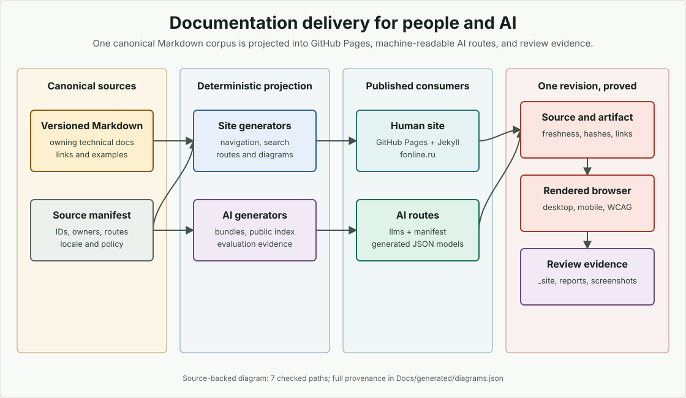

<!-- docs-translation: {"document_id":"documentation-site-publication","locale":"ru","source_path":"Docs/en/contributing/documentation/site-publication.md","source_sha256":"efc77b437d589fd76b76011e6882ae6c6faeb56645cc59c598ee57ae0f4ec41e"} -->

# Публикация сайта документации

> Документация движка. Эта страница определяет, как Markdown-корпус FOnline предварительно просматривается, проверяется и публикуется через существующий маршрут GitHub Pages.

## Назначение

Используйте эту страницу при изменении `_config.yml`, слоя рендеринга документации, custom domain или documentation jobs в GitHub Actions. Она не разрешает создавать отдельное приложение документации или второе дерево контента: canonical source остаётся Markdown в репозитории.

## Проверенные исходные пути

- `_config.yml`
- `CNAME`
- `.ruby-version`
- `Gemfile`
- `.gitignore`
- `.github/workflows/validate.yml`
- `Docs/documentation-manifest.json`
- `BuildTools/docs_ai_delivery.py`
- `BuildTools/tests/test_docs_ai_delivery.py`
- `BuildTools/docs_ai_eval.py`
- `BuildTools/tests/test_docs_ai_eval.py`
- `BuildTools/SnippetPolicy.json`
- `BuildTools/docs_snippets.py`
- `BuildTools/tests/test_docs_snippets.py`
- `BuildTools/DocumentationDiagrams.json`
- `BuildTools/docs_diagrams.py`
- `BuildTools/tests/test_docs_diagrams.py`
- `BuildTools/DocumentationScreenshots.json`
- `BuildTools/docs_screenshots.py`
- `BuildTools/tests/test_docs_screenshots.py`
- `BuildTools/docs_site.py`
- `BuildTools/tests/test_docs_site.py`
- `BuildTools/tests/test_docs_site_layout.py`
- `BuildTools/docs_site_artifact.py`
- `BuildTools/tests/test_docs_site_artifact.py`
- `_layouts/default.html`
- `assets/css/docs.css`
- `assets/js/docs.js`
- `assets/images/fonline-mark.png`
- `_data/docs-site.json`
- `assets/docs-search.json`
- `assets/docs-search.ru.json`
- `Docs/generated/document-routes.json`
- `Docs/ai-evaluation.json`
- `Docs/generated/ai-evaluation-report.json`
- `Docs/generated/snippets.json`
- `Docs/generated/diagrams.json`
- `Docs/assets/diagrams/`
- `Docs/generated/screenshots.json`
- `Docs/assets/screenshots/`
- `llms.txt`
- `llms-full.txt`
- `docs-manifest.json`
- `Docs/en/contributing/decisions/0001-github-pages-markdown-publication.md`
- `Docs/en/contributing/decisions/0003-manifest-backed-ai-documentation-delivery.md`
- `Docs/en/contributing/decisions/0004-manifest-backed-site-navigation-search.md`
- `Docs/en/contributing/decisions/0006-documentation-version-locale-routing.md`

## Production contract

| Задача | Контракт |
|---|---|
| Canonical content | Versioned Markdown в этом репозитории |
| Production provider | GitHub Pages |
| Renderer | Jekyll, совместимый с GitHub Pages |
| Production URL | `https://fonline.ru` |
| Источник custom domain | Root `CNAME`, содержащий только `fonline.ru` |
| Конфигурация сайта | Root `_config.yml` |
| Rendering layer | Только поддерживаемые GitHub Pages themes, plugins, layouts, includes, data и static assets |
| Навигация читателя | Generated `_data/docs-site.json`, используемый default layout репозитория |
| Static search | Generated locale-scoped `assets/docs-search.json` и `assets/docs-search.ru.json`, полностью выполняемые в браузере |
| Обучающие диаграммы | Source-owned local SVG в `Docs/assets/diagrams/` с provenance и hashes в `Docs/generated/diagrams.json` |
| Скриншоты инструментов | Source-owned local PNG в `Docs/assets/screenshots/` с environment, interactions, source/image hashes и recapture triggers в `Docs/generated/screenshots.json` |
| Карта version, locale и routes | Generated `Docs/generated/document-routes.json`, выведенный из stable document IDs и manifest targets |
| Review output | Commit-addressable `_site` artifact и rendered-site validation report из GitHub Actions |
| AI delivery | Root `llms.txt`, ограниченный `llms-full.txt`, public `docs-manifest.json`, deterministic AI evaluation и complete snippet coverage reports |

Маршрут публикации намеренно не зависит от подключаемого игрового проекта. Last Frontier, TLA и public example games могут ссылаться на этот сайт, но не собирают и не определяют его.

<figure class="docs-diagram">
<picture>
<source media="(max-width: 700px)" srcset="../../../assets/diagrams/documentation-delivery-mobile.svg">

</picture>
<figcaption>Human и AI routes являются проекциями одного versioned Markdown corpus. GitHub Pages, machine-readable endpoints и CI evidence используют один manifest, generated artifacts, source revision и content hashes.</figcaption>
</figure>

GitHub Pages использует `jekyll-readme-index`, который обычно превращает route вложенного `README.md` в directory index. Поэтому семь public root/subsystem/example READMEs закрепляют manifest-owned `.html` routes коротким YAML front matter. `_config.yml` исключает local build trees, third-party inputs, private example governance templates и BuildTools subtrees без public pages, сохраняя source files, на которые ссылается документация. Удаление pinned permalink создаёт обещанный каталогом, но не отрендеренный Jekyll route и проваливает source-level и post-build validation.

Обычные `index.md` используют canonical directory URL Jekyll (`/path/`), хотя artifact остаётся `/path/index.html`. `BuildTools/docs_site.py` записывает directory form в navigation, search, locale reservations и route catalog, чтобы canonical tags и published links совпадали с GitHub Pages.

Записи документов манифеста с `visibility: internal` и сгенерированные
артефакты с такой же видимостью являются только внутренними доказательствами
для сопровождающих. `_config.yml` должен исключать их канонические пути и пути
репозиторных указателей из GitHub Pages, а `BuildTools/docs_ai_delivery.py` не
должен включать внутренние модели в публичный AI-пакет.
`BuildTools/docs_site_artifact.py` отклоняет собранный артефакт, если в нём
присутствует любой вариант внутреннего Markdown, JSON, index или
отрендеренного HTML. Публичная документация может вести сопровождающих к этим
файлам через URL исходника GitHub, но не должна обещать для них маршрут на
основном домене.

## Навигация читателя и статический поиск

Public site оборачивает обычный Markdown, отрендеренный Jekyll, в `_layouts/default.html`. Layout добавляет persistent desktop sidebar, mobile navigation, page-local table of contents, source link, code-copy controls, light/dark preference, видимый rolling `master` indicator и EN/RU switch для текущих locale pairs. Markdown остаётся полным и читаемым при открытии непосредственно в GitHub; layout не владеет технической prose.

`Docs/documentation-manifest.json` задаёт navigation groups через stable document ID. `BuildTools/docs_site.py` разрешает ID в текущие titles и paths и записывает:

| Артефакт | Содержимое |
|---|---|
| `_data/docs-site.json` | Site identity, repository/source ref, localized navigation groups, resolved public Markdown routes и current stable-ID locale pairs |
| `assets/docs-search.json` | Compact weighted English token postings и result metadata для каждого public current English human document |
| `assets/docs-search.ru.json` | Compact weighted Russian token postings и result metadata для каждого current translated human document |
| `Docs/generated/document-routes.json` | Current public URLs, canonical future owners, planned English/Russian paths, route availability и required legacy redirects |

Каждая public current human top-level page должна ровно один раз входить в navigation. Generated detail pages не попадают в sidebar, но доступны в поиске через generated index pages. Internal plans, placeholders и AI-only maintainer routes отсутствуют в обеих reader surfaces.

Поиск использует только JavaScript репозитория и browser APIs. Нет hosted index, account, analytics dependency, remote script или server endpoint. Rendered page загружает только index активной локали, а results остаются в ней. Titles и headings имеют больший вес, чем body terms; полные technical identifiers и camel-case components остаются searchable. Чисто числовые components и terms, встречающиеся более чем в 60 процентах locale corpus, исключаются как неразличающие. Компактный JSON записывается как UTF-8 без разворачивания non-ASCII текста в escape-последовательности `\\uXXXX`, поэтому русский бюджет измеряет фактические байты текста. Source manifest независимо применяет reviewed hard limit 1,75 MiB (1 835 008 байт) к каждому generated index. Лимит даёт ёмкость полному двуязычному corpus, но не разрешает исключать документы; при превышении любой локалью generation по-прежнему завершается fail-closed.

После изменения public Markdown membership, titles, paths, lifecycle state, migration targets, version/localization policy, navigation groups или search policy выполните:

```bash
python BuildTools/docs_site.py --write
python BuildTools/docs_site.py --check
```

При изменении visual, fenced или delivery layers сначала создайте diagrams и screenshot catalog, затем snippet report, translation status, site data, AI evaluation report и в конце AI delivery. Evaluation использует site search model, а public `docs-manifest.json` записывает hashes diagram, screenshot, snippet, machine model, evaluation, navigation, search и route catalog. Generated delivery data нельзя редактировать вручную. Presentation меняется в layout или local assets; ownership navigation/search/routing меняется в source manifest. Принятые границы описаны в [проверке snippets](snippets.md), [ADR-0004](../decisions/0004-manifest-backed-site-navigation-search.md), [ADR-0006](../decisions/0006-documentation-version-locale-routing.md), [оценке документации для ИИ](ai-evaluation.md) и [процессе перевода](translation.md).

## Миграция версий, локалей и маршрутов

Unversioned production site является каналом `current`. Он следует rolling `master`, а layout помечает его `Current`; это не утверждение, что `master` является стабильным релизом. Historical review использует repository revisions и commit-addressable `_site` artifacts.

Tagged release snapshots намеренно отложены. Manifest резервирует `/versions/{version}/`, но release page не генерируется до появления immutable supported tags, support matrix и approved follow-up decision. `VERSION`, branch или reachable tag не должны неявно создавать supported documentation line.

Localization policy также принадлежит исходному коду:

- `en` является canonical; принадлежащие манифесту страницы используют текущие пути в `Docs/en/` или явно заданные README-точки входа репозитория и подсистем;
- `ru` является полным зеркалом; в этой ревизии все 197 обязательных соответствий защищены fail-closed проверкой паритета;
- paths в `Docs/en/` прямо зеркалируются в `Docs/ru/`;
- root и subsystem README pages используют explicit pairs, например `README.md` и `README.ru.md`;
- `BuildTools/docs_localization.py` вычисляет normalized SHA-256 каждого canonical English source и отклоняет stale или mismatched Russian pages;
- `Docs/generated/translation-status.json` сообщает точное required/current/missing coverage;
- stable-ID language switching и locale-scoped search активны для каждой обязательной пары; режим manifest enforcement равен `complete`.

`Docs/generated/document-routes.json` фиксирует migration map до перемещения файлов. Каждая public record содержит current route, planned canonical owner/path, locale paths и redirect requirement. Несколько legacy pages могут сходиться только к одному non-`replace` owner destination.

Прежние плоские Markdown-файлы остаются долговечными указателями на канонические страницы, включая ссылки для старых якорей заголовков. Это сохраняет маршруты и в интерфейсе репозитория GitHub, и в Jekyll без сгенерированного HTML и дополнительного redirect-плагина. Сгенерированный реестр маршрутов отклоняет отсутствующих владельцев, коллизии маршрутов и устаревшие записи указателей.

## Маршруты для ИИ и машинного чтения

Static site публикует три generated root endpoints, route catalog и current AI evaluation report рядом с обычным Markdown, отрендеренным Jekyll:

| Route | Назначение |
|---|---|
| `https://fonline.ru/llms.txt` | Краткая карта всех public current pages по типам Diataxis и canonical generated JSON models |
| `https://fonline.ru/llms-full.txt` | UTF-8/LF full-context bundle public current authored pages и generated reference indexes, максимум 2 MiB |
| `https://fonline.ru/docs-manifest.json` | Public stable IDs, locale, owner, lifecycle state, canonical/source/raw URLs, provenance, byte size и SHA-256 hashes |
| `https://fonline.ru/Docs/generated/document-routes.json` | Current/planned paths, version/locale policy, canonical target ownership и legacy redirects |
| `https://fonline.ru/Docs/generated/ai-evaluation-report.json` | Deterministic task-set identity, retrieval ranks, evidence checks, success rate, MRR и failures |
| `https://fonline.ru/Docs/generated/snippets.json` | Каждый public/current/human fenced block, owner/heading, parser harness, hash, template status, result и normative coverage |
| `https://fonline.ru/Docs/generated/diagrams.json` | Diagram IDs, documents, dimensions, alt/caption, source provenance, SVG paths и hashes |
| `https://fonline.ru/Docs/generated/screenshots.json` | Screenshot IDs, documents, dimensions, alt/caption, environment/interactions, provenance, recapture triggers и hashes |

`Docs/documentation-manifest.json` задаёт membership и policy. `BuildTools/docs_ai_delivery.py` отвечает только за deterministic projection; три outputs нельзя редактировать вручную. Каждая public document record содержит canonical human HTML URL на `fonline.ru` и привязанный к `source_ref` clean Markdown URL GitHub raw-content. `llms.txt` использует Markdown route и сохраняет HTML link. Текущий pipeline GitHub Pages/Jekyll 3.10 не может публиковать same-domain raw aliases без дублирования контента или custom plugin, поэтому такие aliases остаются задачей платформы публикации, а не ложным route claim. Generated reference detail pages доступны как Markdown и JSON, но full-context bundle включает их indexes без дублирования больших inventories.

После любого изменения inventoried Markdown или manifest выполните:

```bash
python BuildTools/docs_ai_delivery.py --write
python BuildTools/docs_ai_delivery.py --check
```

При изменении search model или AI task set выполняйте полную dependency chain:

```bash
python BuildTools/docs_diagrams.py --write
python BuildTools/docs_screenshots.py --write
python BuildTools/docs_snippets.py --write --external
python BuildTools/docs_localization.py --write
python BuildTools/docs_site.py --write
python BuildTools/docs_ai_eval.py --write
python BuildTools/docs_ai_eval.py --check
python BuildTools/docs_ai_delivery.py --write
python BuildTools/docs_ai_delivery.py --check
```

Generator завершается ошибкой, а не усечением, если context bundle превышает byte budget. Content hashes используют normalized LF text, поэтому output byte-identical на Windows и Linux. Эти routes помогают discovery и transport, но не переопределяют source precedence в manifest и не повышают internal Engine symbol до public API.

### Проверенное публичное состояние

Состояние проверено 2026-07-10, повторно 2026-07-15 и 2026-08-01 по public state, а 2026-08-02 подтверждено через authenticated GitHub Pages API:

- Pages API сообщает status `built`, source mode `legacy`, branch `master` и folder `/`. Custom domain равен `fonline.ru`, HTTPS enforcement включён.
- `https://fonline.ru/` и legacy index `/Docs/` возвращают HTTP 200. Representative generated routes `/Docs/en/` и `/Docs/ru/` возвращают 404, потому что documentation branch ещё не попала в `master`.
- `CNAME` репозитория содержит `fonline.ru`. Public IPv4 DNS возвращает четыре GitHub Pages addresses от `185.199.108.153` до `185.199.111.153`, а `www.fonline.ru` является CNAME для `fonline.ru`.
- Последний Pages build для remote commit `master` `fee50fb636b5bd1e30509aded929df1fc0e95db5` завершился успешно. Сопутствующий legacy workflow `validate` упал в build lanes, не относящихся к документации, и ещё не содержит pending jobs документационного artifact/browser audit.
- Для `_github-pages-challenge-cvet.fonline.ru` отсутствует public TXT record. DNS routing подтверждён, но GitHub domain-ownership verification записана как `not-observed`, а не выведена из работающего custom domain.

`Docs/documentation-manifest.json` записывает подтверждённый Pages source и отдельно нерешённое состояние ownership verification. Обновляйте audit date и значения только по authenticated settings/API evidence и public DNS, но не по одному rendered page. При посадке документационного корпуса не заменяйте существующий production route и не ослабляйте HTTPS.

DNS account names, registrar credentials, recovery codes и GitHub credentials не должны находиться в public repository. Operational ownership разделено между repository administrators и private domain-administration owner. Именованный account owner хранится в private operations inventory; репозиторий владеет только public domain contract и его validation.

## Совместимое окружение

Local environment закреплён к GitHub Pages dependency set, объявленному в:

- `.ruby-version` для Ruby runtime;
- `Gemfile` для `github-pages` bundle;
- `BuildTools/docs-browser/package.json` и `package-lock.json` для Node, Playwright, Chromium revision и axe-core;
- `Docs/documentation-manifest.json` для machine-readable publication contract.

Текущий render pin: Ruby `3.3.4` и `github-pages` `232`. Browser validation использует Node `24.16.0`, Playwright `1.62.0` с Chromium `151.0.7922.34` и axe-core `4.12.1`. Перед изменением render value сравните его с [опубликованными версиями GitHub Pages dependencies](https://pages.github.com/versions/) и одновременно обновите manifest declarations. Browser dependency update требует exact lock-file change, обоих focused tests и complete route audit; не используйте `latest` в CI.

`Gemfile.lock` намеренно ignored согласно GitHub Pages guidance. Exact `github-pages` pin является repository-level compatibility boundary; official Pages build image остаётся CI authority.

## Локальная сборка и предварительный просмотр

Установите Ruby из `.ruby-version` и Bundler, затем из корня Engine выполните:

На Windows используйте RubyInstaller с Devkit/MSYS2. GitHub Pages bundle содержит native gems; bare Ruby archive может разрешить bundle, но не соберёт эти dependencies.

```bash
python BuildTools/docs_diagrams.py --check
python BuildTools/docs_screenshots.py --check
python BuildTools/docs_site.py --check
bundle install
bundle exec jekyll build --trace
python BuildTools/docs_site_artifact.py --site-dir _site
npm ci --prefix BuildTools/docs-browser
npx --prefix BuildTools/docs-browser playwright install chromium
npm --prefix BuildTools/docs-browser run audit
```

Rendered output находится в `_site/`, является disposable и ignored by git. Успешная сборка не содержит Jekyll/Liquid errors; `_config.yml` включает strict front-matter parsing. Browser validation обслуживает `_site/` только на ephemeral `127.0.0.1` port и пишет `Workspace/docs-browser-audit-report.json` и сохраняемый набор screenshots в `Workspace/docs-browser-screenshots/`. Она не обращается к production и не исполняет snippets.

Для interactive preview:

```bash
bundle exec jekyll serve --livereload --host 127.0.0.1 --port 4000
```

Откройте `http://127.0.0.1:4000/`. Остановите server перед переключением branch или сменой Ruby/Jekyll pin. Поддерживаемая GitHub процедура: [Testing your GitHub Pages site locally with Jekyll](https://docs.github.com/en/pages/setting-up-a-github-pages-site-with-jekyll/testing-your-github-pages-site-locally-with-jekyll).

## Артефакт pull request

Job `Build documentation site` в `.github/workflows/validate.yml` запускается после быстрых standalone documentation checks. Он:

1. Checkout точной pull-request или push revision.
2. Рендерит root репозитория через `actions/jekyll-build-pages@v1` в `_site/`.
3. Запускает `BuildTools/docs_site_artifact.py` на готовом дереве.
4. Устанавливает manifest-pinned Node, npm lock, Chromium revision и Linux browser libraries.
5. Запускает `BuildTools/docs-browser/audit.mjs` на том же дереве.
6. Загружает отдельные static-validation и browser-validation artifacts с JSON и screenshots.
7. Загружает `documentation-site-<commit-sha>` через `actions/upload-artifact@v4` на 14 дней.

Static post-build gate требует каждый current route и available locale route из `Docs/generated/document-routes.json`, проверяет byte-for-byte static AI/search/generated-model endpoints, canonical URLs, HTML language, один `h1`, skip/main landmarks, accessible image/button names, unique IDs, search targets и links к publishable local resources.

Browser gate посещает каждый catalog route в трёх profiles, принадлежащих manifest: desktop при 1440 x 1000 CSS pixels, mobile при 390 x 844 CSS pixels и `zoom-200` при 640 x 512 CSS pixels с device scale factor 2. Последний profile моделирует физический viewport 1280 x 1024 при 200 percent browser zoom и требует compact navigation/reflow contract без mobile user agent. Страница не должна иметь выбранных WCAG 2.2 A/AA axe violations, page/console/request errors, undecoded images, clipped reading column, fixed-header/sidebar overlap или reachable page-level horizontal scroll. Interaction scenarios дополнительно проверяют keyboard skip navigation, English technical/prose search, native-dialog Escape, theme persistence, copy feedback, compact/mobile drawer semantics, focus containment/restoration, Russian search, `html lang`, active locale, все explicit README language pairs, exact paired-route switching, rendering архитектурной схемы и Content Showcase и русский reflow при 200 процентах. Сохраняемые screenshots включают responsive document/navigation states, все Russian README entry points, translated documents, архитектурную схему и материалы Content Showcase для каждого profile, а также `zoom-200-russian-documentation.png` с точным физическим размером 1280 x 1024 без изменения Pages deployment path.

Automated axe results покрывают только machine-detectable criteria. Raw incomplete nodes остаются rule-level records с node/route counts и bounded examples. Если `color-contrast` incomplete вызван clipped text в scroll container, harness вычисляет effective colors с alpha composition, применяет WCAG relative-luminance formula и требует 4.5:1 или 3:1 для large text. Failed или unresolvable fallback проваливает route; raw и resolved counts остаются в report. Profile `zoom-200` является детерминированным доказательством reflow, accessibility и screenshot для одного viewport, а не доказательством для каждого браузера, magnifier операционной системы, font override или production rendering difference. Green job не доказывает screen-reader behavior, cognitive accessibility, content clarity или production equivalence. Release review требует keyboard-only и representative assistive-technology checks на landed artifact и production domain.

Job проверяет и предварительно показывает production-compatible render. Он не deploy, не меняет Pages settings, branch или DNS. Существующий GitHub Pages source остаётся единственным production route.

Reviewers должны просмотреть каждый retained screenshot, включая отдельное русское изображение reflow при 200 процентах, затем интерактивно landing page и changed pages. Проверьте rolling version indicator, locale switch, page TOC, code blocks, tables, local assets, keyboard order и один screen-reader landmarks/headings pass. Перед выпуском повторите 200 percent zoom на landed artifact или production domain; локальный profile не заменяет проверку этой среды. Green source/artifact/axe check сам по себе не доказывает читаемость для каждого пользователя.

## Проверка production

После попадания documentation change в configured Pages source:

1. Убедитесь, что `Validate documentation` и `Build documentation site`, включая browser audit, зелёные для published commit.
2. Проверьте оба validation reports, каждый browser screenshot и commit-addressable site artifact до объяснения production difference поведением Pages.
3. Откройте `https://fonline.ru/` и English, Russian и legacy routes хотя бы одного migrated document.
4. Проверьте sidebar highlight и mobile usability.
5. Найдите `Game.Sync` и `map baking` на английском, затем `игровой клиент` на русском; results должны оставаться на canonical routes активной локали.
6. Проверьте HTTPS и сохранение `fonline.ru` в browser.
7. Проверьте, что `CNAME` содержит ровно `fonline.ru`.
8. Разрешите domain и подтвердите target GitHub Pages.

PowerShell DNS check:

```powershell
Resolve-DnsName fonline.ru -Type A
```

POSIX DNS check:

```bash
dig +short fonline.ru A
```

Передайте mismatch и repository, и domain administrators. Не обходите Pages/DNS problem через committed generated HTML, смену canonical domain или alternate deployment workflow.

## Контрольный список проверки

1. Markdown остаётся canonical authored content.
2. `CNAME`, `_config.yml`, `Gemfile`, `.ruby-version`, manifest и CI согласованы по publication contract.
3. `python BuildTools/tests/test_docs_validate.py` проходит.
4. `python BuildTools/tests/test_docs_snippets.py` и `python BuildTools/docs_snippets.py --check --external` проходят без выполнения команд.
5. Tests/checks diagrams, screenshots и site source/layout проходят с ownership/freshness и version/locale/route collision coverage.
6. `python BuildTools/tests/test_docs_ai_eval.py` и `python BuildTools/docs_ai_eval.py --check` проходят на том же search model.
7. `python BuildTools/tests/test_docs_ai_delivery.py` и `python BuildTools/docs_ai_delivery.py --check` проходят.
8. Localization test/check проходят; production bilingual launch также использует `--enforce-complete`.
9. `python BuildTools/docs_validate.py` проходит.
10. Local или CI Jekyll build создаёт `_site/` без errors со всеми AI routes, reports, navigation, search indexes, route catalog, layout и assets.
11. Site artifact test и `docs_site_artifact.py --site-dir _site` проходят на rendered tree.
12. Browser unit test проходит, pinned npm dependencies установлены из lock, browser audit проходит каждый route во всех трёх manifest profiles и все interaction scenarios.
13. Desktop, mobile и 200-percent reflow navigation, search, TOC, source link, theme, overflow, focus containment и screenshots проверены в artifact.
14. Отдельный русский screenshot при 200 процентах просмотрен; manual keyboard, production-domain 200 percent zoom и representative screen-reader checks записаны для release candidate; axe incomplete nodes review выполнен.
15. Site, static report, browser report и screenshot artifacts привязаны к exact reviewed commit.
16. Production source settings и DNS не менялись без явного administrator review.
