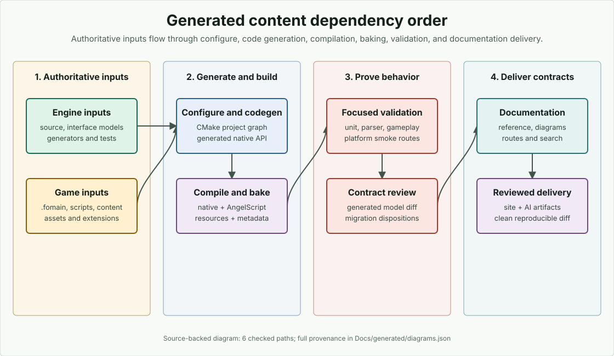

# Работа с генерируемым содержимым

<!-- docs-translation: {"document_id":"generated-content-workflow","locale":"ru","source_path":"Docs/en/how-to/build/generated-content.md","source_sha256":"584de92dadc16009b62a743bc4853e520808865a7c5b335bcde07d6b21982ce9"} -->

Это руководство объясняет, что нужно перегенерировать после изменения
исходников Engine или игры, какие данные являются authoritative и как
проверять generated output, не редактируя его вручную.

## Проверенные исходные пути

- `BuildTools/Init.cmake`
- `BuildTools/cmake/ProjectInterface.json`
- `BuildTools/cmake/stages/Codegen.cmake`
- `BuildTools/cmake/stages/ScriptsAndBaking.cmake`
- `BuildTools/codegen.py`
- `BuildTools/docs_metadata.py`
- `BuildTools/docs_contract_diff.py`
- `BuildTools/docs_validate.py`
- `Source/Tools/MetadataBaker.cpp`
- `Examples/MinimalProject/CMakeLists.txt`
- `Examples/MinimalMultiplayer/CMakeLists.txt`

## Сначала классифицируйте результат

В FOnline есть три разных generated layers:

| Слой | Типичный результат | Владеющий источник |
|---|---|---|
| Configure/code generation | build-tree `GeneratedSource/`, generated native bindings и internal config | CMake project interface, C++ tags/templates, project options |
| Resource baking | `Baking/`, `Resources/`, `ServerResources/`, `PlatformBinaries/`, `Cache/` | `.fomain` resource packs, scripts, prototypes, maps, assets, metadata tags |
| Documentation generation | `Docs/generated/`, `_data/docs-site.json`, search/AI artifacts | source-backed interface models и `Docs/documentation-manifest.json` |

Generated output является evidence, а не editing surface. Исправьте source
annotation, interface model, project config, generator или authored asset,
затем выполните генерацию снова.

<figure class="docs-diagram">
<picture>
<source media="(max-width: 700px)" srcset="../../../assets/diagrams/generated-content-pipeline-mobile.svg">

</picture>
<figcaption>Выполняйте регенерацию слева направо. Delivery artifacts используют модели и hashes предыдущих этапов, поэтому зеленый итоговый gate имеет смысл, только когда configure, compile, bake и focused validation уже успешно завершены.</figcaption>
</figure>

## Configure и генерация native-исходников

Embedding project вызывает staged BuildTools pipeline:

```cmake
StartProjectGeneration()
RegisterProjectOptions()
AddThirdPartyLibraries()
RegisterEngineSources()
SetupCodeGeneration()
BuildCoreLibraries()
BuildApplications()
SetupScriptsAndBaking()
BuildPackages()
FinalizeProjectGeneration()
```

`SetupCodeGeneration()` использует native sources движка и проекта,
code-generation tags, templates и project options. `ForceCodeGeneration`
является dependency для script compilation и baking targets, поэтому
устаревшие native metadata нельзя скрыть за посторонним incremental resource
bake.

Повторите configure после изменения CMake options, source registration, stage
hooks, generated templates или Engine pin. Соберите самый узкий target, который
компилирует затронутый generated source.

## Компиляция scripts

Для AngelScript-проектов:

```bash
cmake --build <build-dir> --config RelWithDebInfo --target CompileAngelScript
```

До компиляции форматируйте authored scripts через wrapper из
[Стиль AngelScript и рефакторинг](../scripting/style-and-refactoring.md). Ошибка generated `.fos`
исправляется во владеющих metadata, generator или authored source с последующей
регенерацией; derived file не является целью ручного редактирования.

BuildTools вызывает generated ASCompiler с параметрами:

```text
-ApplyConfig <project .fomain> -ApplySubConfig NONE
```

Так проверяется master project contract, а не удобный development overlay.
Проект может добавлять focused script/test targets, но master compile route
должен оставаться зеленым.

## Baking ресурсов

Сначала выполните обычный incremental route:

```bash
cmake --build <build-dir> --config RelWithDebInfo --target BakeResources
```

Используйте forced route, когда изменился input graph:

```bash
cmake --build <build-dir> --config RelWithDebInfo --target ForceBakeResources
```

Forced bake нужен после изменения:

- resource-pack directories, explicit files, include/exclude patterns,
  recipients или baker lists;
- baker behavior или baked binary schema;
- language set/order или text fallback policy;
- prototype/map migrations или identity rules;
- generated metadata tags, entity/property layouts, remotes, enums,
  fixed/value/ref types;
- output paths или platform binary composition;
- incremental-cache bug или пропущенной dependency.

Не удаляйте регулярно весь workspace. Сохраняйте logs и failed outputs
достаточно долго для диагностики ownership, затем удаляйте только
документированные disposable directories.

## Понимание metadata outputs

`MetadataBaker` разбирает project script tags и создает side-specific metadata,
например:

```text
Baking/Metadata/Metadata.fometa-server
Baking/Metadata/Metadata.fometa-client
```

Эта пара используется runtime dynamic metadata registration и также может
создать project-owned каталог remote calls:

```bash
python Engine/BuildTools/docs_metadata.py \
  --metadata Baking/Metadata/Metadata.fometa-server \
  --metadata Baking/Metadata/Metadata.fometa-client \
  --write
```

Обе стороны должны совпадать для каждого paired remote call. Не
восстанавливайте каталог повторным разбором `.fos` с другой grammar: baked
metadata является authoritative.

Metadata changes могут влиять на persistence, network synchronization, script
bindings, content validation и save compatibility, даже если native C++
компилируется. Проверьте generated model и выполните реальный bake вместе с
узким runtime/test route.

## Регенерация контрактов документации

Каждый checked interface имеет собственный generator. Запустите затронутый
generator с `--write`, затем проверьте все outputs:

```bash
python BuildTools/docs_diagrams.py --write
python BuildTools/docs_screenshots.py --write
python BuildTools/docs_reference.py --write
python BuildTools/docs_snippets.py --write --external
python BuildTools/docs_description_translations.py --write
python BuildTools/docs_localization.py --write
python BuildTools/docs_site.py --write
python BuildTools/docs_ai_eval.py --write
python BuildTools/docs_ai_delivery.py --write
python BuildTools/docs_validate.py
```

Focused format/CLI/CMake generators перечислены в
[Generated API and Metadata](../../reference/metadata/index.md).
`docs_validate.py` проверяет byte-for-byte freshness, но не заменяет focused
semantic test.

Для source/API change сравните состояние с base revision:

```bash
python BuildTools/docs_contract_diff.py \
  --baseline-git-ref <base> \
  --current-dir Docs/generated \
  --dispositions Docs/contract-change-dispositions.json \
  --write \
  --enforce
```

Заполните обязательные owner, migration, release-note и compatibility
dispositions. Никогда не редактируйте generated JSON только ради подавления
comparator-а.

## Порядок зависимостей

Если изменение пересекает несколько layers, используйте этот порядок:

1. обновите source contracts, project configuration, authored content и tests;
2. повторите configure и регенерацию native sources;
3. скомпилируйте native targets и scripts;
4. выполните baking ресурсов и side-specific metadata;
5. запустите focused native/content/runtime tests;
6. регенерируйте canonical documentation models, source-owned diagrams,
   screenshot catalogs и Markdown projections;
7. регенерируйте example и snippet inventories, localization status, затем
   route, site, search, AI-evaluation и AI-delivery artifacts;
8. выполните aggregate documentation validation и contract diff;
9. проверьте итоговый diff на неожиданный generated churn.

Поздние шаги могут использовать hashes или inventories ранних. Генерация
site/AI до обновления canonical pages может дать внутренне согласованные, но
устаревшие delivery artifacts.

## Проверка generated changes

Проверяйте input и output вместе:

- generated symbols должны вести к source tag/template;
- generated settings/options должны вести к runtime-consumed interface;
- baked files должны вести ровно к одному resource pack и baker;
- side-specific metadata должны совпадать там, где contract paired;
- удаленные IDs требуют migration и compatibility review;
- посторонний массовый churn обычно означает проблему path, ordering,
  line ending, toolchain или non-determinism.

Generated artifacts должны быть детерминированы для одинаковых inputs. Перед
commit запустите generator дважды или используйте его `--check` mode.

## Восстановление

| Ошибка | Восстановление |
|---|---|
| Generated source не компилируется | Исправьте source tag/template или project registration, повторите configure и build |
| Script compiler и runtime расходятся | Убедитесь, что они используют одинаковые config, Engine revision и свежие generated metadata |
| Formatter меняет `T?`, форму cast/template или named argument | Используйте Engine-aware wrapper из [Стиля AngelScript и рефакторинга](../scripting/style-and-refactoring.md), а не raw clang-format |
| Стороны metadata расходятся | Исправьте paired declarations и выполните baking обеих сторон |
| Incremental resources остаются устаревшими | Запустите `ForceBakeResources`; проверьте pack selection и baker dependency tracking |
| Documentation `--check` не проходит | Запустите названный generator с `--write`, затем выясните причину изменения source |
| Contract diff сообщает о break | Восстановите compatibility или добавьте точный reviewed disposition; не скрывайте model delta |
| Site/search/AI output неожиданно меняется | Сначала регенерируйте canonical pages, затем delivery artifacts по dependency order |

## Дисциплина обновлений

Каждое обновление Engine или embedding project является generation-bearing
change. Запишите старые и новые revisions, проверьте полный диапазон, определите
затронутые generated layers, выполните регенерацию в dependency order и
обновите владеющие docs/tests в том же изменении. Зеленая native build сама по
себе не доказывает актуальность scripts, resources, metadata, documentation или
compatibility outputs.
