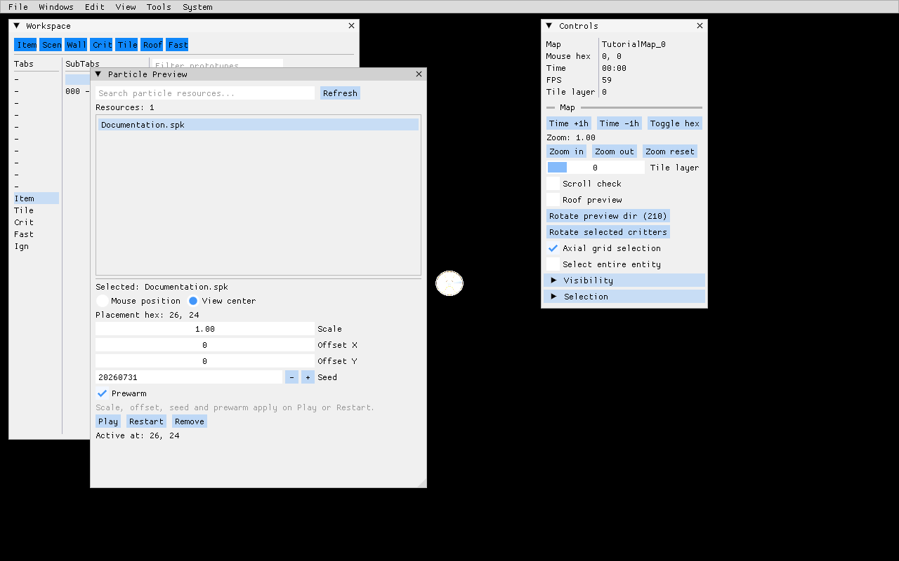

<!-- docs-translation: {"document_id":"mapper-interactive-manual","locale":"ru","source_path":"Docs/en/how-to/tools/mapper-interactive.md","source_sha256":"b021026bc629ff501477cc19a4a781f8943e669243cefffe365dc1ce0b0eabff"} -->

# Интерактивное руководство по Mapper

> Руководство движка по штатной интерактивной работе в Mapper. Каталоги карт,
> прототипы, вкладки редактора, скрипты, правила проверки и критерии приёмки
> конкретной игры принадлежат встраивающему проекту.

Используйте эту страницу для ручного редактирования карт. Для AngelScript на
стороне Mapper, пакетной обработки карт, захвата рендера и API автоматизации
используйте [инструменты Mapper](mapper.md). Сериализованный контракт `.fomap`
описан в [формате карт](../content/map-format.md), а показанные ниже окна частиц
в [инструментах создания частиц](particle-authoring.md).

## Сборка и запуск

Включите Mapper в конфигурационном пресете встраивающего проекта и соберите
ресурсы вместе с приложением:

```bash
cmake --build Build/<preset> --config RelWithDebInfo --target BakeResources <DevName>_Mapper
```

Запустите собранный Mapper с главным конфигурационным файлом проекта.
Начальная карта необязательна:

```bash
<output>/Binaries/Mapper-<platform>-<arch>/<DevName>_Mapper \
  -ApplyConfig <path-to-project.fomain> \
  -Mapper.StartMap <DeclaredMapName>
```

Для рендера исполняемый файл использует запечённые клиентские ресурсы, а для
редактирования карт и исходных ассетов читает входные каталоги, объявленные
пакетами ресурсов. После изменения прототипа, изображения, эффекта, частицы или
скрипта выполните запекание до оценки результата в редакторе. Успешный запуск
исполняемого файла не доказывает актуальность его ресурсов.

`Mapper.StartMap` задаёт имя объявленного `[ProtoMap]`, которое не обязано
совпадать с именем файла. `Mapper.StartHexX` и `Mapper.StartHexY` перемещают
начальную камеру, когда оба значения положительны. Точные пути и подконфигурации
должны находиться в задачах запуска проекта, а не собираться каждым автором
вручную.

## Ориентация в интерфейсе

<figure>

<figcaption>Снимок Mapper из минимального многопользовательского примера. Particle Preview выбирает запечённый ресурс Documentation.spk, размещает его в центре вида и показывает детерминированные настройки масштаба, смещения, seed и prewarm рядом со штатными окнами Workspace и Controls.</figcaption>
</figure>

Основная область просмотра показывает карту. Строка меню и плавающие окна
ImGui располагаются поверх неё и не сериализуются в карту. Положение и
видимость окон являются пользовательскими настройками инструмента, поэтому
восстановленная раскладка может отличаться от первого запуска. Команда
`Windows -> Settings -> Reset layout` возвращает окна в исходные позиции, не
изменяя данные карты.

Основные рабочие поверхности:

| Поверхность | Назначение |
|---|---|
| **Map browser** | Фильтрация всех объявленных карт, открытие карты и различение текущей (`*`) и уже загруженных (`+`) записей. |
| **Controls** | Просмотр текущей карты, гекса под мышью, времени, FPS, слоя тайлов, масштаба, видимости, политики выделения, предпросмотра крыши и направления криттера. |
| **Workspace** | Фильтрация и размещение предметов, тайлов, криттеров и проектных прототипов через вкладки и подвкладки. |
| **Content** | Просмотр содержимого контейнеров, загруженных карт, операций создания, загрузки, сохранения и изменения размера карты, а также сообщений Mapper. |
| **Inspector** | Редактирование типизированных свойств, массивов и структур выбранной сущности; сброс к прототипу и при необходимости применение изменения ко всем выбранным сущностям. |
| **History** | Просмотр истории отмены и повтора текущей карты и переход к нужной операции. |
| **Console** | Выполнение команд Mapper и просмотр их истории. |

При свежей раскладке видимы Map browser и Controls. Workspace переключается
клавишей `F7`, Content сочетанием `Shift+F7`. Inspector открывается по `F9`,
когда выбрана сущность или предмет контейнера.

## Справочник меню

### File

| Команда | Поведение |
|---|---|
| **Save current** (`Ctrl+S`) | Сериализует текущую карту в найденный для неё исходный контейнер. |
| **Reset changes** | Перезагружает текущую карту из последнего сохранённого состояния исходника. |
| **Exit** | Запрашивает штатное завершение Mapper. |

Для изменённой текущей карты справа в строке меню появляется заметная кнопка
`*** Save ***`. Она означает наличие несохранённого авторского состояния.
Сохраняйте его явно: завершение процесса само по себе не фиксирует изменения.

### Windows

Меню открывает Workspace, Content, Console, Critter animations, Animation
viewer, Particle viewer, Script call, Map browser, Controls, History,
инструменты поддерживаемых подсистем частиц и Settings. Записи подсистем
условны:

- **Particle preview** доступен, когда включена хотя бы одна подсистема частиц
  времени выполнения.
- **SPARK particle editor** доступен только при `FO_SPARK_PARTICLES`.
- Создание Effekseer-эффектов выполняется во внешнем закреплённом редакторе
  Effekseer; Mapper показывает его запечённый результат `.efk`.

Специализированные автономные просмотрщики описаны в
[руководстве по AnimationViewer и ParticleViewer](animation-particle-viewers.md).

### Edit

Undo и redo показывают имя текущей операции, когда оно известно. Select all,
clear selection, delete, copy, cut и paste работают с сущностями Mapper и
участвуют в истории карты. Copy/paste использует внутренний буфер сущностей
процесса Mapper, а не формат обмена или буфер операционной системы.

### View

Переключатели видимости охватывают Items, Scenery, Walls, Critters, Tiles, Roof
и Fast. При изменении любого из них текущая карта пересобирается, поэтому
результат виден сразу. `Axial grid selection` выбирает решётку выделения.
`Select entire entity` определяет, должно ли выделение визуального компонента
распространяться на владеющую им сущность.

Видимость служит только авторским инструментом. Она не удаляет содержимое и не
доказывает корректность видимости, блокировки, освещения или владения во время
выполнения игры.

### Tools

| Команда | Назначение |
|---|---|
| **Rebuild map** | Пересоздать представление текущей карты после изменения данных или видимости. |
| **Mark blocked hexes** | Визуализировать заблокированные клетки для авторской проверки. |
| **Reverse lights** | Выполнить команду Mapper по обращению света. |
| **Merge by command / Break by command** | Выполнить проектные обработчики команд композиции предметов. |
| **Merge multihex items / Break multihex items** | Преобразовать совместимые наборы предметов в мультигексовые меши и обратно. |

Merge и break являются структурными изменениями. До сохранения проверьте
выделение, владение, смещения, блокировку и историю отмены.

### System

System переключает полноэкранный режим (`F11`), сворачивает окно (`F12`),
выгружает атласы текстур и управляет прокруткой у края для текущего оконного
режима. Выгрузки атласов являются диагностическими данными, а не авторскими
ресурсами.

## Открытие и проверка карты

1. Запеките актуальные ресурсы проекта.
2. Запустите проектную задачу Mapper или исполняемый файл.
3. Откройте **Map browser**, отфильтруйте по объявленному имени карты и выберите
   её.
4. Подтвердите имя карты в **Controls**.
5. Сверьте размер, рабочий гекс, поведение fixed/outside и авторские секции с
   [форматом карт](../content/map-format.md).
6. На насыщенной карте переключайте по одному классу содержимого.
7. До редактирования откройте **Content** и подтвердите состояние загрузки и
   целевой исходный контейнер.

Mapper может держать загруженными несколько карт, показывая только одну как
текущую. Текущее, загруженное и сохранённое состояния различны. Закрытие
вкладки или смена текущей карты не делает несохранённое состояние другой карты
авторитетным.

## Размещение и редактирование сущностей

Вкладки Workspace формируются из загруженных прототипов и проектной
скриптовой настройки. Штатные режимы включают Item, Tile, Critter, Fast,
Ignore, Inventory, Messages, Maps и десять пользовательских слотов.

1. Откройте Workspace клавишей `F7`.
2. Выберите вкладку и подвкладку.
3. При большой коллекции отфильтруйте её по имени прототипа.
4. Выберите предпросмотр прототипа, чтобы перейти в режим размещения.
5. Щёлкните левой кнопкой по допустимому гексу карты.
6. Щёлкните правой кнопкой или нажмите `Escape`, чтобы выйти из режима.
7. Выберите новую сущность и нажмите `F9` для проверки свойств экземпляра.
8. Сохраняйте только после проверки направления, смещений, владения, блокировки
   и обязательных проектных полей.

Inspector разбирает значения через ту же систему свойств, которую использует
автоматизация Mapper. Поддерживаются скалярные значения, массивы и
зарегистрированные структуры. Некорректный текст не становится частичным
изменением. `PageUp` и `PageDown` перемещают по строкам свойств; `Escape`
сначала отменяет активное редактирование свойства, затем очищает выделение или
режим размещения.

Используйте **Apply to all** только для заведомо однородного выделения.
Одинаково отображаемое имя свойства всё равно может иметь разный смысл у
прототипов встраивающего проекта.

## Выделение, перемещение и буфер

Левая кнопка выбирает или размещает объект в зависимости от текущего режима.
Рамочное выделение и перемещение фиксируются как записи истории по завершении
взаимодействия. Перетаскивание правой кнопкой двигает карту с сохранением
инерции; правый щелчок без перемещения отменяет размещение или контекст
выделения. Стрелки прокручивают карту.

Средняя кнопка выполняет текущее контекстное действие: может повернуть
выбранных криттеров или направление предпросмотра частиц, а также возвращает
масштаб к `1.0`. Когда направление или масштаб должны быть точными, задавайте
их через Controls.

Copy, cut и paste сохраняют данные сущностей Mapper во внутреннем буфере.
После вставки:

- подтвердите целевой гекс и смещения;
- проверьте идентификаторы размещения и владение;
- проверьте мультигексовое и блокирующее поведение;
- проверьте ссылки, которые могут быть недействительны за пределами исходной
  карты;
- просмотрите получившуюся запись истории до сохранения.

Сериализованная идентичность размещения и владение секциями описаны в
[формате карт](../content/map-format.md).

## Справочник клавиш

Горячие клавиши подавляются, пока активно текстовое поле ImGui.

| Клавиша | Действие |
|---|---|
| `F1` .. `F6` | Переключить видимость Items, Scenery, Walls, Critters, Tiles и Fast. |
| `F7` / `Shift+F7` | Переключить Workspace / Content. |
| `F8` | Переключить прокрутку у края для текущего полноэкранного или оконного режима. |
| `F9` | Открыть Inspector для выделения либо очистить выделение, если Inspector уже видим. |
| `F10` | Переключить гексовый оверлей Mapper. |
| `F11` / `F12` | Переключить полноэкранный режим / свернуть окно. |
| `Shift+F11` | Выгрузить атласы текстур. |
| `Shift+0` .. `Shift+4` | Выбрать слой тайлов от 0 до 4. |
| `Tab` / `Shift+Tab` | Переключить осевую решётку выделения / выделение всей сущности. |
| `Delete` | Удалить выбранные сущности. |
| `Escape` | Отменить редактирование свойства, очистить выделение или выйти из режима размещения. |
| Numpad `+` / `-` | Сдвинуть время карты на плюс/минус один час, когда ничего не выбрано. |
| `Ctrl+Z` / `Ctrl+Y` | Отменить / повторить операцию. |
| `Ctrl+A` | Выбрать всё. |
| `Ctrl+C` / `Ctrl+X` / `Ctrl+V` | Копировать / вырезать / вставить. |
| `Ctrl+S` | Сохранить текущую карту. |
| `Ctrl+D` | Переключить ограничение прокрутки камеры текущей карты. Для обычной интерактивной работы оставляйте его включённым, а для overscan-проверки отключайте осознанно. |
| `Ctrl+B` | Разметить заблокированные гексы, аналогично **Tools -> Mark blocked hexes**. |
| `~` | Переключить Console. |
| Стрелки | Прокручивать текущую карту. |

## Отмена, сброс и дисциплина сохранения

История относится к текущей карте и ограничена по размеру; она не заменяет
систему контроля версий. Используйте её для локальных авторских операций, а
затем проверяйте сериализованный diff.

Перед сохранением:

1. Подтвердите нужную карту и исходный контейнер.
2. Проверьте маркер изменений и последние записи History.
3. Проверьте изменённые сущности и их идентификаторы размещения.
4. Пересоберите карту, если менялась видимость или композиция.
5. Сохраните через `Ctrl+S`.
6. Просмотрите текстовый diff.
7. Запустите проектные проверки формата, прототипов и карт и выполните
   запекание.
8. Проверьте карту в сцене времени выполнения, а не только в Mapper.

**Reset changes** отбрасывает несохранённые изменения текущей карты и
восстанавливает исходную версию. После ошибочного сохранения средством
восстановления остаётся система контроля версий.

## Настройки и восстановление раскладки

Settings показывает текущее разрешение, полноэкранный режим, популярные
разрешения и **Reset layout**. Раскладка окон хранится отдельно от запечённых
ресурсов: в реестре `HKCU\Software\FOnline\Mapper` на Windows и в
пользовательском хранилище приложения на других платформах.

Сбрасывайте раскладку, если окна оказались за пределами экрана после смены
монитора или DPI. Для исправления раскладки ImGui не нужно удалять кэши
ресурсов или повторять запекание.

## Окна частиц и просмотрщиков

Particle Preview предназначен для размещения в контексте карты, задания
детерминированных seed/prewarm, масштаба и смещений, перезапуска и удаления.
Particle Viewer предназначен для изолированного воспроизведения и диагностики
области просмотра. Редактор SPARK следует применять только к исходникам
`.spark`. Полный выбор инструмента и процесс проверки описаны в
[инструментах создания частиц](particle-authoring.md).

## Контракт снимков и автоматизации

Mapper script API предоставляет один метод снимка:

| Метод | Содержимое кадра | Завершение |
|---|---|---|
| `Game.SaveMapperScreenshot(path)` | Текущий render target карты и рисование скриптового интерфейса Mapper; без более поздней композиции ImGui уровня приложения. | Синхронная запись PNG. |

В Engine нет script method захвата полного окна UI. Минимальный
многопользовательский пример предоставляет воспроизводимый видимый профиль;
после стабилизации окон захватите окно приложения platform screenshot tool:

```powershell
cmake --build Build\windows --config Release --target ForceBakeResources FOMM_Mapper
Build\windows\Binaries\Mapper-Windows-win64\FOMM_Mapper.exe `
  -ApplyConfig FOnlineMinimalMultiplayer.fomain `
  -ApplySubConfig MapperDocumentationCapture
```

Профиль открывает `TutorialMap`, запускает `Documentation.spk` с фиксированным
seed и закрепляет viewport `1280x800`. Проверяемый PNG и полные хэши исходников зарегистрированы в
[generated/screenshots.json](../../../generated/screenshots.json).

Используйте `Render.HeadlessWindow = True` для внеэкранного рендера карты, но
не `Render.NullRenderer`: нулевой рендерер не может создать визуальный кадр.

## Диагностика ошибок

| Симптом | Что проверить |
|---|---|
| Карта отсутствует в Map browser | Корни входных прототипов, `Baking.ProtoFileExtensions`, объявленное имя `[ProtoMap]` и выбранные bake/config. |
| Прототип отсутствует в Workspace | Включение пакета ресурсов, запекание прототипа, имя коллекции и проектные скрипты вкладок. |
| Карта отображается чёрной | Не является ли карта намеренно пустой, текущие масштаб и гекс, отсутствующие тайлы, изображения и эффекты, журнал рендерера. |
| Изменение видно, но карту нельзя сохранить | Разрешение исходного пути, файлы только для чтения, владение многокарточным контейнером и сообщения Mapper. |
| Inspector отклоняет значение | Сгенерированный тип свойства, написание enum, синтаксис массива/структуры, nullability и ограничения прототипа. |
| Исходник частицы есть в списке, но предпросмотра нет | Включённую подсистему, запечённый `.spk`/`.efk`, эффект и текстуру, границы, seed/prewarm и исключения в журнале. |
| Окна отсутствуют или находятся за экраном | Откройте меню Windows, затем выполните Settings -> Reset layout. |
| На снимке UI видна только карта | `SaveMapperScreenshot` захватывает только карту; снимите видимое окно приложения platform screenshot tool. |

Считайте ошибками `ScriptException`, `VerificationException`, строки
assert/fatal, отсутствующие ресурсы, неудачное сохранение и недействительные
объявления карт. Не публикуйте снимок или карту только потому, что процесс
вернул нулевой код.

## Проектный критерий завершения

Встраивающий проект должен предоставить:

- документированную задачу запуска и репрезентативную карту;
- правила проектных вкладок и фильтров;
- правила свойств и размещения;
- валидаторы содержимого и карт;
- чистое запекание;
- приёмку в сцене времени выполнения на поддерживаемых рендерерах;
- provenance снимка, когда проектная документация показывает конкретные
  ассеты;
- правило обновления, требующее проверять это руководство и
  [инструменты Mapper](mapper.md) при каждом изменении закреплённой ревизии
  Engine.

Интерактивный Mapper является авторской поверхностью. Авторитетными остаются
сериализованный исходник, проектные тесты и поведение времени выполнения.
