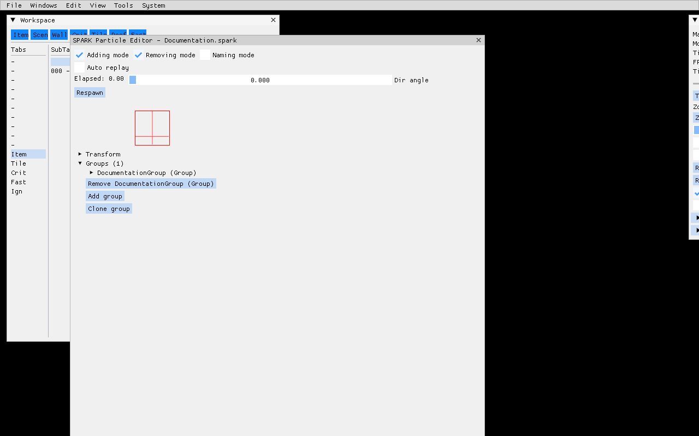

<!-- docs-translation: {"document_id":"particle-authoring-tools","locale":"ru","source_path":"Docs/en/how-to/tools/particle-authoring.md","source_sha256":"9dbc060c7f534201f014e8fe86db20133ec83a55bf01eda4a437a2401535dc8c"} -->

# Инструменты авторинга частиц

> Принадлежащий Engine workflow для Particle Preview, встроенного редактора
> исходников SPARK, внешнего авторинга Effekseer и сфокусированных viewer.
> Каталоги частиц проекта, art direction, бюджеты, лицензии ресурсов и сцены
> приёмки принадлежат встраивающей игре.

Точный контракт `.spark`, `.spk`, `.efkproj`, `.efk`, baker, bounds, cache и runtime
описан в [формате частиц](../content/particle-format.md). Эта страница описывает
работу с инструментами авторинга. Standalone Particle Viewer описан в
[инструментах просмотра](animation-particle-viewers.md).

## Полный маршрут авторинга

1. В Mapper оставляйте поверхности Map browser, Controls, Workspace, Inspector
   и History видимыми при выборе и размещении содержимого.
2. Для исходника SPARK откройте встроенный editor, используйте Adding mode или
   Removing mode и явно завершайте работу через Save или Discard. Исходник
   Effekseer остаётся во внешнем editor закреплённой версии.
3. Повторно запеките ресурс, затем закрепите backend, resource, seed, prewarm,
   direction и состояние replay перед сравнением focused preview и runtime routes.
4. Для свидетельства ревью захватите видимое окно приложения Mapper platform
   screenshot tool. Храните это UI-свидетельство отдельно от map-only TGA,
   создаваемого `Game.SaveMapperScreenshot`.

## Выберите backend до авторинга

Включайте только backend, который проект намерен поставлять:

```cmake
SetOption(FO_SPARK_PARTICLES ON)
SetOption(FO_EFFEKSEER_PARTICLES OFF)
```

| Backend | Редактируемый исходник | Запечённый runtime | UI авторинга |
|---|---|---|---|
| SPARK | XML `.spark` | `.spk` | Mapper -> Windows -> SPARK particle editor |
| Effekseer | `.efkproj` | `.efk` | Зафиксированный внешний Effekseer editor |

Particle Preview и Particle Viewer backend-neutral: они показывают запечённые runtime-ресурсы
всех включённых backend. SPARK editor специфичен для исходника: он редактирует
`.spark`. Никогда не редактируйте `.spk` или `.efk` вручную.

После изменения исходника запеките его до runtime-проверки или preview Mapper:

```bash
cmake --build Build/<preset> --config RelWithDebInfo --target BakeResources
```

Используйте `ForceBakeResources`, когда исследуете инвалидацию зависимостей,
а не как обычную замену корректного resource graph.

## Particle Preview в Mapper

Откройте **Windows -> Particle preview**. Окно появляется, только если активно хотя бы
одно particle factory extension.

Preview:

- ищет запечённые ресурсы `.spk` и `.efk`;
- может обновить список после запекания;
- размещает выбранный эффект на гексе под мышью или в центре текущего вида;
- принимает scale от `0.01` до `100`;
- применяет X/Y offsets;
- принимает детерминированный целочисленный seed, когда backend его поддерживает;
- опционально прогревает систему;
- предоставляет **Play**, **Restart** и **Remove**;
- показывает активный гекс карты.

Изменения scale, offset, seed и prewarm вступают в силу по **Play** или **Restart**, а не
через мутацию уже запущенного instance. Перед сравнением несвязанных эффектов
нажмите **Remove**, чтобы старые системы не накладывались.

Средняя кнопка мыши вращает направление preview в контексте карты. Текущее направление
также показано в Controls. Размещение на карте полезно для проверки occlusion, depth,
освещения и scale, которые изолированный viewer не доказывает.

### Воспроизводимый preview при запуске

Настройки Mapper могут автоматически открыть один запечённый эффект:

```ini
Mapper.StartMap = TutorialMap
Mapper.ParticlePreviewEffect = Documentation.spk
Mapper.ParticlePreviewScale = 1.0
Mapper.ParticlePreviewSeed = 20260731
Mapper.ParticlePreviewPrewarm = True
```

Для документации и доказательств визуальной регрессии используйте фиксированные
seed и viewport. Детерминированный seed не делает время кадра детерминированным на всех
renderer: также запишите backend, warmup, разрешение и ревизию Engine.

## Браузер исходников SPARK

Соберите с `FO_SPARK_PARTICLES`, затем откройте
**Windows -> SPARK particle editor**. Браузер исходников сканирует raw resource inputs
в поисках `.spark`, а не baking output. Он показывает число исходников и открытых
редакторов, поддерживает фильтр без учёта регистра и обновляется после изменений
дерева исходников.

Выберите исходник, чтобы открыть по одному редактору на каждый asset path. Повторный
выбор уже открытого исходника переводит его редактор на передний план вместо
создания второй изменяемой копии.

Для детерминированной автоматизации или capture документации задайте авторский
исходник явно:

```ini
Mapper.SparkEditorSource = Documentation.spark
```

Mapper проверяет значение по raw-входам `.spark` и завершает запуск с ошибкой,
указывающей исходник, если ассет отсутствует. Настройка открывает редактор напрямую,
не оставляя одновременно видимым браузер исходников.

Если `.spk` есть, а его исходника `.spark` нет, проект потерял редактируемый authority
или настроил неверные input roots. Восстановите исходник; не занимайтесь reverse engineering
запечённого blob как обычным workflow.

## Редактор SPARK

<figure>

<figcaption>Mapper открывает авторский исходник Documentation.spark, а не запечённый `.spk`. Редактор сочетает живой preview с режимами добавления, удаления и именования, а также редактируемую иерархию объектов System и Group.</figcaption>
</figure>

Управление в заголовке:

| Элемент | Назначение |
|---|---|
| **Adding mode** | Показывает элементы для добавления поддерживаемых дочерних объектов и записей коллекций. |
| **Removing mode** | Показывает кнопки удаления рядом с изменяемыми объектами и записями. |
| **Naming mode** | Открывает редактирование имён для поддерживающих имена объектов SPARK. |
| **Auto replay** | Возрождает preview после завершения эффекта. |
| **Elapsed** | Показывает время preview. |
| **Dir angle** | Вращает направление preview. |
| **Respawn** | Немедленно пересоздаёт preview. |

При открытии редактор хранит backup исходника. **Save** сериализует текущую
систему SPARK обратно в raw `.spark`, переиндексирует ресурсы и инвалидирует
соответствующий `.spk`, чтобы следующее запекание не использовало молча устаревший
runtime. **Discard** восстанавливает открытый backup. При закрытии изменённого редактора
можно сохранить, отбросить изменения или отменить закрытие.

### Иерархия объектов

Корнем является SPARK `System`, содержащая Groups. Group владеет вместимостью частиц,
lifetime, инициализаторами/интерполяторами, эмиттерами, модификаторами, actions и одним
renderer. Трансформируемые объекты показывают поля позиции/ориентации там, где тип
SPARK их поддерживает.

Встроенный редактор покрывает:

- System и Group;
- default, random, simple и graph float/color initializers и interpolators;
- зоны Point, Sphere, Plane, Ring, Box и Cylinder;
- эмиттеры Static, Random, Straight, Spheric и Normal;
- модификаторы Gravity, Friction, Obstacle, Rotator, Collider, Destroyer, Vortex,
  EmitterAttacher, PointMass, RandomForce и LinearForce;
- ActionSet и SpawnParticlesAction;
- `SparkQuadRenderer`.

Adding mode создаёт валидный объект по умолчанию и вставляет его в выбранного владельца.
Removing mode может разорвать ссылки: перед сохранением проверяйте отношения
между emitter/action/group. Naming mode помогает в больших системах, но имена не заменяют
каталог частиц проекта и стабильный путь исходника.

### Выбор текстуры и эффекта

`SparkQuadRenderer` хранит имена ресурсов эффекта и текстуры, которые читает
запечённая/runtime-система.

Выбор текстур в редакторе перечисляет файлы `.tga` рядом с исходником `.spark`.
Уже заданная валидная ссылка на PNG всё ещё может загружаться и показываться после
запекания, но picker её не предлагает. Выберите согласованную с инструментом конвенцию
проекта или редактируйте/проверяйте исходник явно, если сохраняете PNG.

Preview текстур использует канонический parser запечённых спрайтов. Он требует ровно
одно направление и один кадр, а затем восстанавливает логическое изображение,
если включён sprite mesh cropping. Raw поток байтов PNG/TGA не является запечённым
sprite resource и не должен передаваться этому loader.

Эффекты должны быть запечёнными `.fofx`-ресурсами, совместимыми с particle rendering.
Проверьте alpha/depth/blend state по [формату эффектов](../content/effect-format.md),
затем проверьте результат на каждом поддерживаемом renderer.

## Минимальный исходник SPARK

Минимальный полезный loop содержит System, один Group, эмиттер и `SparkQuadRenderer`:

```xml
<SPARK>
  <System name="DocumentationParticle">
    <attrib id="groups">
      <Group name="DocumentationGroup">
        <attrib id="capacity" value="8" />
        <attrib id="life time" value="1;1" />
        <attrib id="emitters">
          <StaticEmitter>
            <attrib id="tank" value="-1" />
            <attrib id="flow" value="4" />
            <attrib id="force" value="0" />
            <attrib id="zone">
              <Point>
                <attrib id="position" value="(0,0,0)" />
              </Point>
            </attrib>
            <attrib id="full" value="false" />
          </StaticEmitter>
        </attrib>
        <attrib id="renderer">
          <SparkQuadRenderer>
            <attrib id="draw in scene" value="true" />
            <attrib id="active" value="true" />
            <attrib id="effect" value="Effects/Particles_ColorAdd.fofx" />
            <attrib id="texture" value="Radiation.png" />
            <attrib id="scale" value="0.5;0.5" />
            <attrib id="atlas dimensions" value="1;1" />
          </SparkQuadRenderer>
        </attrib>
      </Group>
    </attrib>
  </System>
</SPARK>
```

Это зафиксированная fixture
`Examples/MinimalMultiplayer/Particles/Documentation.spark`. Отрицательный tank означает
неограниченную эмиссию; положительный flow управляет числом эмиссий в секунду.
Production-эффекты должны выбирать capacity, lifetime, flow, bounds и renderer state из измеренных
визуальных/производительных требований, а не копировать эти учебные значения.

## Авторинг Effekseer

FOnline не встраивает редактор Effekseer. Используйте зафиксированный Engine toolchain
Effekseer `1.80.5`:

1. Откройте или создайте `.efkproj` в зафиксированном внешнем редакторе.
2. Храните ссылочные текстуры/модели/материалы в project-owned resource inputs.
3. Сохраните редактируемый `.efkproj`.
4. Запустите `BakeResources`; `EffekseerCompiler` создаст `.efk` вместе с обязательными
   metadata bounds Engine.
5. Откройте запечённый `.efk` в Particle Preview Mapper.
6. Откройте его в Particle Viewer для изолированного playback, камеры, фона, wireframe
   и viewport-проверок.
7. Проверьте его на репрезентативной runtime-карте и каждом поддерживаемом backend.

Не заменяйте редактор/компилятор более новой версией только потому, что она открывает файл.
Файлы проекта и скомпилированные payload зависят от версии. Обновляйте зафиксированный
toolchain как рецензируемое изменение зависимости Engine с перезапеканием fixture и визуальным
сравнением.

В Mapper нет редактора исходников Effekseer. Отсутствующий `.efkproj` нельзя исправить в
Mapper: восстановите исходник проекта.

## Particle Viewer

Particle Viewer может работать standalone или внутри Mapper. Он предоставляет сфокусированный
список ресурсов, playback/restart, детерминированный seed, prewarm, scale, offset, direction,
управление viewport/фоном и wireframe-проверку без контента карты.

Используйте его для:

- локального для эффекта framing и измеренных bounds;
- воспроизводимых сравнений backend;
- поиска clipping, неожиданного размера billboard и depth-артефактов;
- отделения ошибок частиц от ошибок карты, прототипа или освещения.

Затем испытайте эффект в preview Mapper: успех в изоляции не доказывает размещение
на карте, occlusion и world scale. Полные элементы управления и имена target приведены в
[инструментах просмотра](animation-particle-viewers.md).

## Workflow валидации

Для каждого изменённого эффекта:

1. Проверьте XML/проект исходника в его owning editor.
2. Один раз запустите `ForceBakeResources`, когда доказываете чистый путь от исходника к runtime.
3. Убедитесь, что ожидаемый `.spk` или `.efk` появился, а авторского runtime-blob в исходниках нет.
4. Запустите preview с фиксированным seed и документированным prewarm.
5. Несколько раз перезапустите его; проверьте завершение one-shot и loop.
6. Проверьте минимальные и максимальные scale/offset/direction проекта.
7. Проверьте bounds и wireframe в Particle Viewer.
8. Разместите эффект на репрезентативной внутренней и внешней карте, где это применимо.
9. Проверьте каждый поддерживаемый renderer/платформу.
10. Просмотрите логи на ошибки отсутствующих эффектов/текстур, parser, bounds, cache и native backend.
11. Для видимого пользователю релизного изменения запишите screenshot/video evidence с ревизией и provenance asset.

`BakeResources` доказывает конвертацию. Он не доказывает художественный timing, визуальную
читаемость, overdraw, платформенную производительность, корректное ownership и cleanup.

## Типичные ошибки

| Симптом | Вероятная причина и следующая проверка |
|---|---|
| Particle Preview отсутствует | При конфигурации не был включён ни один backend частиц. |
| Исходник есть, runtime-ресурса нет | Неверный resource pack, выключенный backend, ошибка запекания или несовпадение расширения. |
| `.spk`/`.efk` есть в source control | Сгенерированный runtime output был принят за исходник или скопирован обратно; удалите его и восстановите редактируемый исходник. |
| В SPARK browser нет записи | `.spark` находится вне raw resource input roots или его исключает текст фильтра. |
| SPARK editor открылся, preview не работает | Нет запечённого `.spk`, эффекта или текстуры; невалидный исходник; неверная cardinality запечённого спрайта; проверьте лог. |
| Эффект исчезает до capture | Завершились one-shot tank/lifetime; используйте Auto replay, Respawn или намеренную loop fixture. |
| Изменения scale/seed игнорируются | После изменения элементов нажмите Play или Restart. |
| Исходник Effekseer не открывается в Mapper | Это ожидаемо: Mapper просматривает `.efk`; редактируйте `.efkproj` в зафиксированном внешнем редакторе. |
| Эффект обрезается в Viewer или model attachment | Перезапеките измеренные bounds и проверьте scale исходника, радиус billboard, model link и старый кэшированный runtime output. |
| На другом renderer результат отличается | Сравните effect state, фильтрацию/ориентацию текстуры, depth, timing и поддержку backend с теми же seed и viewport. |

## Production-практики

- Явно различайте исходные и runtime-расширения в документах, скриптах и resource packs.
- Давайте эффектам стабильные описательные пути; не кодируйте в них временные task IDs.
- Храните зависимости текстур/эффектов достаточно близко для рецензии ownership и лицензий.
- Предпочитайте ограниченные capacities и измеренные loops неограниченной визуальной нагрузке.
- Используйте фиксированные seeds только для воспроизводимых evidence; сохраняйте намеренную runtime-случайность там, где она нужна игре.
- Проверяйте cleanup при выгрузке карт, исчезновении сущностей, перезапуске viewer и закрытии окон редактора.
- Храните небольшой свободно лицензируемый пример эффекта независимо от любого игрового проекта. Эту роль выполняет fixture minimal multiplayer.
- Согласовывайте руководство Particle Format, это руководство, сфокусированные тесты, примеры и снимки при каждом изменении particle/editor source или перемещении Engine pin.

## Граница владения

Engine владеет backend-интеграцией, исходными/runtime-форматами, baker, Particle Preview,
SPARK editor, сфокусированным Viewer, script/runtime-фасадом и переиспользуемой диагностикой.

Встраивающая игра владеет:

- выбором включаемого и поддерживаемого backend;
- конкретными эффектами и их зависимостями;
- стилем, читаемостью, доступностью и возрастными рейтингами контента;
- бюджетами GPU/CPU/overdraw;
- лицензиями и provenance ресурсов;
- политикой прикрепления к картам/моделям;
- платформенными сценами приёмки и release evidence.

Примеры и снимки демонстрируют контракт инструмента. Они не определяют визуальную
политику production-игры.
