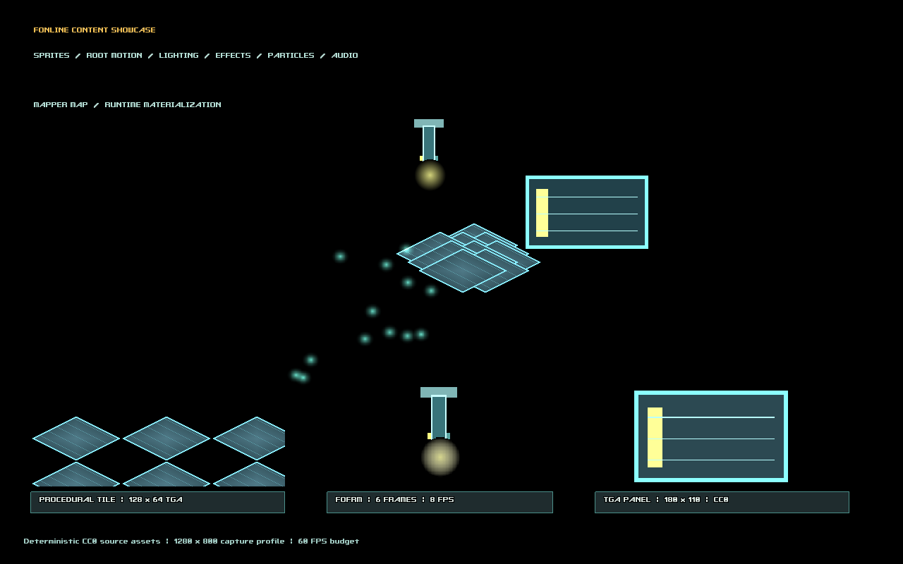
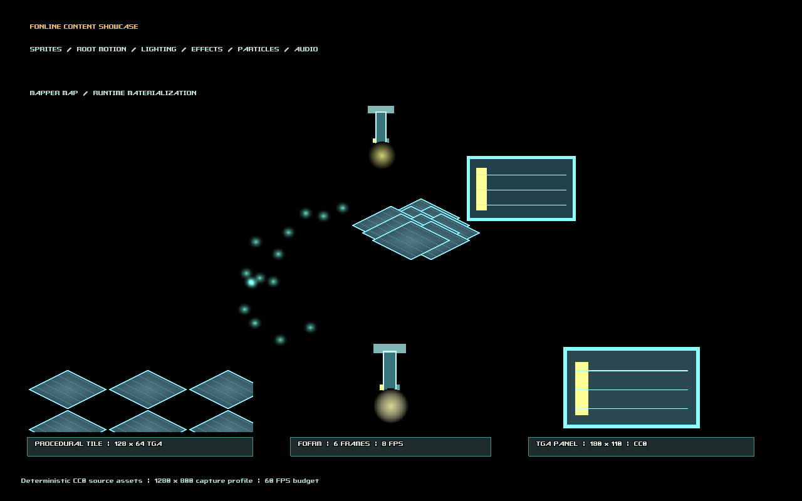
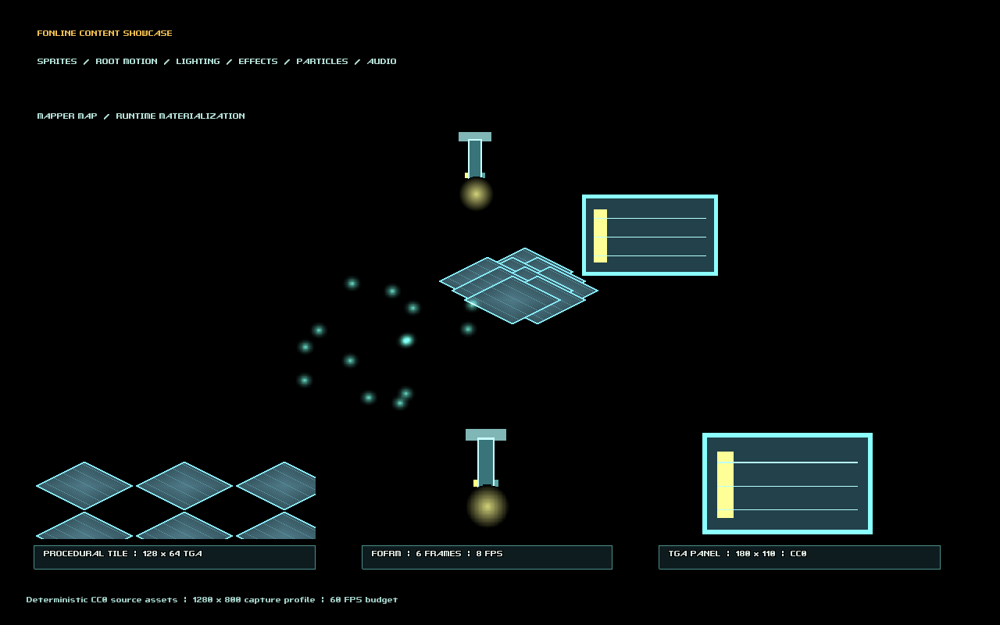

<!-- docs-translation: {"document_id":"content-showcase-readme","locale":"ru","source_path":"Examples/ContentShowcase/README.md","source_sha256":"261a3d5784dcc49490fcace8099a099f907244f11015c869dcac90fb776dad34"} -->

# Демонстрация контента FOnline

Автономный презентационный проект FOnline, который показывает конвейер
контента без зависимости от Last Frontier, TLA или другой игры.







Готовый проект охватывает:

- генерируемые исходные TGA и шестикадровую анимацию FOFRM;
- авторские метаданные корневого движения `NextX`/`NextY`;
- статический источник света и собственный аддитивный эффект `.fofx`;
- ограниченную систему частиц SPARK и короткий эффект WAV;
- исходную карту `.fomap` с явными идентификаторами размещения;
- английские и русские тексты прототипов;
- headless-проверки исходников, контента и жизненного цикла клиента/сервера;
- видимый Direct3D-снимок с машинной проверкой областей композиции;
- native-пресеты Windows/Linux, маршрут снимка OpenGL через Xvfb/Mesa, а также маршруты компиляции, упаковки и браузерного запуска WebAssembly;
- машиночитаемые права на ассеты, бюджеты и происхождение снимков.

Это пример рендеринга и авторинга, а не стартовая игра. Для изучения жизненного
цикла проекта и взаимодействия клиента с сервером сначала используйте
[`MinimalProject`](../MinimalProject/README.ru.md) и
[`MinimalMultiplayer`](../MinimalMultiplayer/README.ru.md).

## Требования

- CMake 3.22 или новее;
- Python 3;
- Node.js 20 или новее и Emscripten SDK для проверки Web runtime;
- Visual Studio с поддержкой C++ в Windows либо GCC и Ninja Multi-Config в
  Linux;
- пакеты Xvfb, Xauth и программного рендеринга Mesa для эталонного снимка Linux;
- checkout движка в каталоге `Engine/`.

В отдельном репозитории инициализируйте точный submodule Engine, записанный в
репозитории. При работе внутри дерева исходников Engine локальный fixture может
использовать junction или символическую ссылку из этого каталога в корень
движка.

## Проверка native-проекта

Windows:

```powershell
python validate.py
```

Linux:

```bash
python3 validate.py
```

Валидатор проверяет детерминированные исходные ассеты и их SHA-256,
перегенерирует и проверяет полный `.fomain`, конфигурирует пресет хоста,
запекает ресурсы, собирает клиент и сервер, запускает изолированный тест
контента и завершает реальную headless-сессию клиента и сервера. Сессия не
может пройти, пока не загружены TGA, FOFRM, SPARK, эффект и WAV.

## Создание эталонного снимка

В Windows после конфигурации:

```powershell
cmake --build --preset windows-capture
```

В Linux после конфигурации запустите видимый клиент внутри X11 display.
Обязательный workflow устанавливает ту же закреплённую группу пакетов и
принудительно использует программный Mesa для воспроизводимости:

```bash
LIBGL_ALWAYS_SOFTWARE=1 SDL_VIDEODRIVER=x11 \
  xvfb-run --auto-servernum --server-args="-screen 0 1280x800x24" \
  cmake --build --preset linux-capture
```

Цель запускает реальный клиент Direct3D 11 или OpenGL с разрешением 1280 x 800
и сохраняет двенадцать прогретых кадров. `capture_showcase.py` отклоняет разорванные или
неполные кадры, если отсутствует заголовок, runtime-карта, галерея исходников
или строка происхождения, после чего сохраняет лучший полный кадр по backend-специфичному
пути в `captures/`. Контракт снимка хранит ревизию Engine,
digest исходников, выбранный кадр, хэш изображения, viewport, backend, дату и
пиксельные доказательства, а при запуске в CI также идентификатор GitHub run.

Сохранённые изображения Windows Direct3D 11 и Chromium WebGL 2 являются
локальными доказательствами. Сохранённое изображение Linux OpenGL является
CI-доказательством из run `30937990249` репозитория
`cvet/fonline-content-showcase`; перед добавлением сюда проверены digest архива,
хэш изображения, процессный отчёт, точная привязка Engine и области пикселей.
Запись Web доказывает, что упакованный клиент
загрузил все обязательные ответы, подключился к native-серверу, достиг
`resources_loaded` и `world_ready`, создал буфер WebGL 2 размером 1280 x 800 и
прошёл те же проверки областей изображения, что и native-снимки. Обязательная
job `linux-showcase-capture` отвечает за воспроизводимый маршрут на программном
Mesa и неизменяемый workflow-артефакт; запускайте её заново при каждом изменении,
которое требует пересъёмки сохранённых доказательств.

## Проверка Web-сборки

Активируйте Emscripten SDK, задайте его корень в `FO_EMSDK` и выполните:

```bash
python3 validate.py --web
```

Web-маршрут проверяет контракт авторских исходников, конфигурируется через
toolchain Emscripten движка, собирает браузерный клиент и проверяет непустые
артефакты JavaScript и WebAssembly. Это быстрый gate только компиляции; он не
заявляет доказательство пакета или пикселей.

Соберите и проверьте полный поставляемый пакет с baking на native-хосте:

```bash
python3 validate.py --web-package
```

Этот маршрут выполняет force-bake через native Baker Windows/Linux, собирает
Web-клиент, создаёт raw- и ZIP-payload и проверяет точный состав из шести файлов,
сигнатуру WebAssembly, `Resources.data`, загрузчик LZ4, сгенерированную Web-страницу,
равенство архива и CRC. Явная переменная окружения `FO_EMSDK` имеет приоритет над
SDK, найденным в workspace движка.

Один раз установите закреплённую браузерную зависимость самого примера, затем
запустите полную немутирующую проверку в браузере:

```bash
cd WebTests
npm ci
npx playwright install chromium
cd ..
python3 validate.py --web-runtime
```

Runtime-маршрут включает упаковку, запускает native headless-сервер и HTTP-сервер
пакета, наблюдает все обязательные HTTP-ответы и маркеры клиента/сервера, требует
контекст WebGL 2, отклоняет ошибки консоли, страницы, сети, Engine и скриптов и
проверяет снимок композитора native-контрактом пикселей. Runtime-результаты
остаются в `Workspace/`; сопровождающие применяют
`capture_showcase_web.py --update-contract --output captures/web-webgl2.png`
только при намеренной замене сохранённого эталона.

## Карта исходников

| Путь | Ответственность |
|---|---|
| `ShowcaseAssets/Showcase/` | Перераспространяемые исходники изображений, анимации, эффекта, частиц и звука |
| `Content/ShowcaseContent.fopro` | Прототипы персонажа, предметов, света, частиц и локации плюс тексты EN/RU |
| `Maps/ShowcaseMap.fomap` | Компактная галерея со стабильными идентификаторами размещения |
| `Scripts/Showcase.fos` | Вход, проверки жизненного цикла, загрузка ресурсов, видимая композиция и выбор кадров |
| `assets/provenance.json` | Точный путь, лицензия, происхождение и SHA-256 каждого ассета |
| `quality/performance-budget.json` | Ограничения размера, плотности карты, частиц, звука, viewport и FPS |
| `captures/capture-contract.json` | Состояние доказательств по backend и причины пересъёмки |
| `showcase-web-package.json` / `showcase-web-runtime.json` | Точные контракты состава пакета, браузера, сети, маркеров, viewport и ошибок |
| `WebTests/` | Принадлежащий примеру Playwright runtime с закреплённым lock-файлом |
| `generate_assets.py` | Детерминированная генерация TGA и WAV только стандартной библиотекой |
| `generate_config.py` | Полная конфигурация проекта из актуальных настроек Engine |

Runtime-имена ресурсов начинаются с `Showcase/`; `ShowcaseAssets` является
только каталогом источника данных проекта. Отделение авторского входа от
`Resources-Baked`, `ServerResources`, `Cache` и `PlatformBinaries` не позволяет
локальным результатам случайно стать исходниками.

## Показанные практики авторинга

1. Явно храните права. Каждый распространяемый ассет имеет единственную запись
   с точным digest и покрыт файлом [`ASSET_LICENSE.md`](ASSET_LICENSE.md).
2. Ограничивайте дорогой контент. Ёмкость частиц, число статических предметов,
   длительность звука, объём исходников, viewport и FPS являются проверяемыми
   данными, а не устными обещаниями.
3. Проверяйте границы отдельно. Source-check доказывает байты и ссылки; baking
   доказывает конвертеры; content-test доказывает прототипы и карту; headless
   smoke доказывает загрузку и lifecycle; видимый снимок доказывает пиксели.
4. Сохраняйте метаданные авторинга. Время кадров FOFRM и каждое значение
   `NextX`/`NextY` проверяются явно.
5. Основывайте заявления о backend на доказательствах. Direct3D 11 и WebGL 2
   имеют отдельные сохранённые снимки; ни один из них не означает визуальную
   приёмку OpenGL.

## Обновление Engine

Смена ревизии Engine является изменением документации. В том же pull request:

1. запишите старую и новую точные ревизии Engine;
2. просмотрите весь входящий диапазон изменений изображений, эффектов, частиц,
   звука, карт, рендера, снимков, конфигурации, CMake и Web;
3. перегенерируйте `FOnlineContentShowcase.fomain` и детерминированные ассеты;
4. запустите native-проверки исходников, контента и runtime, а также все
   затронутые платформенные маршруты;
5. переснимите каждый затронутый backend и обновите запись доказательств;
6. обновите этот документ и `README.md`, если изменились команды, поведение,
   бюджеты, ограничения или доказательства.

Не обновляйте только хэши после визуального отличия. Объясните изменение,
просмотрите декодированное изображение и оставьте новый снимок только при
намеренной композиции.

## Честные ограничения

- В галерее нет production-аутентификации, хранения, боя, экономики,
  развёртывания, установщика, подписи и политики отката.
- Headless-маршрут подтверждает принятие звука, но не слышимость и качество
  сведения на реальном устройстве.
- Пример показывает 2D-контент; 3D-модель намеренно исключена ради компактной
  проверки исходников и прав.
- Метаданные корневого движения FOFRM влияют здесь на кадры представления и не
  перемещают авторитетную игровую сущность.
- Публичная видимость репозитория, неизменяемые теги, размещённая Web-сборка и
  release-доказательство Linux OpenGL остаются действиями владельца публикации.
